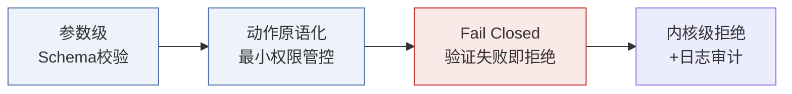

# 工具调用零信任管控

## 核心结论

- Agent 最有价值动作都通过工具调用发生，**工具是注入最危险的落点**；防御重点从"防止注入发生"前移到"注入发生后不能让动作放大"[[1]](#ref-1)。
- 零信任三条铁律：**论证最小权限、多趁手工具吞并高权限（并合检查）、非计划外调用必须触发内核级动作验证/问询**[[1]](#ref-1)。
- 最硬兜底：**Fail Closed 原则**——验证组件挂或是非模糊，一律拒绝执行[[1]](#ref-1)。

## 三层防御战术

<b>图1 工具调用零信任三层</b>

### 1. 参数级 Schema 校验

对抗"模型被诱导生成错误参数"（如注入导致读取不该读的 uid）：

| 战术 | 做法 |
|---|---|
| 健壮的工具接口 | 参数从**来源系统**取，而非上下文（触发式防护） |
| 检测 Agent | 用高置信度 LLM 检查工具输入，低置信度交给人工 |
| 对工具输入施压 | 严格 Pydantic 校验 + 结构化输出抑制放宽 + failsafe 拒绝异常 |
| 工具间读类型匹配 | 二次校验工具返回是否属合法读类型，防对上下文下药导致返回值被解析为命令 |

### 2. 动作原语化

- **Janus 框架**：把 Agent 动作原子化为原语，任何权限外的动作调用都被**内核拒绝**并记录日志；工具只暴露最小集。
- 配合输出侧[[输出验证与人工审批]]的强制 schema 与审计，动作原语构成一张封闭的调用图。
- **异层次工具标注**：显式标注哪些工具属于跨越信任边界的**高风险调用**（如写库/发信/转账），此类调用强制人工确认。
- **并发工具调用的内存隔离**（AgentSys）：受不可信数据影响的 memory slot 与可信隔离。

### 3. Fail Closed

- 验证组件不可用 → 拒绝动作；无法判定 → 拒绝动作；宁可服务不可用，不让风险动作静默通过。
- 与关键操作人工审批[[7]](#ref-7)组成最后人类防线。

## 效果与局限

- 效果：配合任务对齐与权限最小化，可把注入在整个 Agent 链路中的**爆点收敛到工具参数这一小面**，压缩攻击面与影响半径[[1]](#ref-1)。
- 局限：工具数量大 → 校验成本高；内核拒绝策略需工具接口设计规范配合（见[[Function Tool设计规范]]）；无法消解可信上下文内部攻击（需架构隔离 + 双LLM）。

## 相关页面

- [[LLM-Agent安全防护总览]]：第④层防御
- [[Function Tool设计规范]]：工具接口设计的强制 Schema 基础
- [[输出验证与人工审批]]：出口把关
- [[LLM权限最小化]]：权限模型配合

## 参考来源

- [[raw/papers/LLM-Agent安全防护-提示词注入防御与权限最小化综合研究.md]]
- [[raw/articles/deepseek-agent防提示词注入.md]]
- [[raw/articles/doubao-LLM权限最小化落地.md]]

---

[1] 综合 DeepSeek/豆包 Agent 安全素材与论文，见 [[raw/papers/LLM-Agent安全防护-提示词注入防御与权限最小化综合研究.md]]
[7] OWASP. [Substantial Abuse: High-risk actions require human approval](https://github.com/OWASP/www-project-top-10-for-large-language-model-applications/blob/main/2_0_vulns/LLM01_PromptInjection.md)