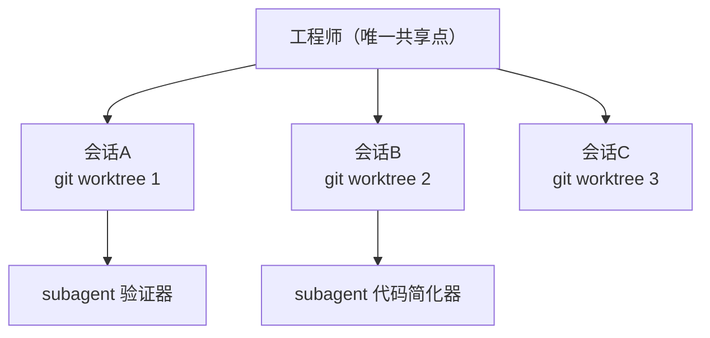

# 并行会话与子代理

## 编排示意

## 核心结论
- **并行会话（parallel session）**＝多个完整 Claude Code 实例、各在独立 git worktree 上工作各自任务，彼此一无所知，唯一共享的是**steering 的工程师** [[The AI-Native SDLC playbook]]。
- **子代理（subagent）**＝单个会话内的作用域助手：自己的上下文窗口与工具限制，适合跨任务复用的小职能（验证应用行为、简化代码、调研代码库）。
- 起点建议 **2~3 个并行会话**，实际上限＝"一个人能审得动的流数"；只有评审跟得上才加会话。

## 要点拆解
- **任务切分**：从 plan 的独立性判断哪些任务不碰同一批文件——不独立的放同一会话顺序做，独立的拆到 worktree（`claude --worktree feature-auth`）。
- **冲突规避**：worktree 是独立检出与分支，避免会话在文件上互相碰撞；多个会话产出的控制来自**仓库内配置**（hooks、权限），对全部会话生效，会话行为归因到运行它的工程师。
- **子代理定义**：`.claude/agents/*.md`，含 name / 何时用的 description / 可用工具；示例（verifier）"启动应用、验证改动与其邻接流程、只报告不修复" [[The AI-Native SDLC playbook]]。
- **运维收益**：并行会话数＝工程师在飞任务数；auto-agent 模式下进一步放大个人与团队并行度，是自主跑通 SDLC 闭环的基础。

## 相关页面
- [[AI-native-SDLC]]：并行与子代理在六阶段的调度位置
- [[Hooks护栏与审批门]]：并行会话的全部控制来自仓库配置 + managed settings
- [[plan模式]]：从 plan 独立性判断并行拆分
- [[Agent反馈闭环]]：verifier 子代理 vs 全程反馈循环的边界

## 参考来源
- [[The AI-Native SDLC playbook]]