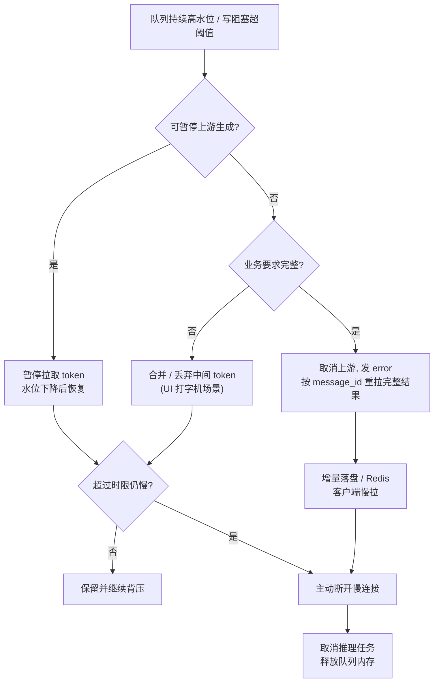

# 慢消费者处置

## 核心结论

- 慢消费者不能无限等，需监控并主动处置。监控指标：每连接缓冲区水位、排空速率（drain rate）、连续写阻塞时长。
- 超过阈值（如缓冲持续满10s、写超时5s、空闲30s、排空超时30s）判定为慢连接，**主动断开**并同时取消上游。
- **关键配套是断线续传**：把会话内容增量落盘（Redis/DB），客户端带Last-Event-ID从断点续传。有了兜底才敢激进杀慢连接——把"内存里扛住慢消费者"转化为"随时安全断开慢消费者"。

## 处置决策流

## 相关页面
- [[SSE背压与内存治理总览]]：五层框架全局视角
- [[SSE有界队列]]：第二层——水位的分级治理
- [[断线续传]]：能激进断开的前提保障
- [[背压透传]]：第一层——透传TCP背压

## 参考来源
- [[raw/papers/面向SSE流式转发的背压与内存治理研究.md]]