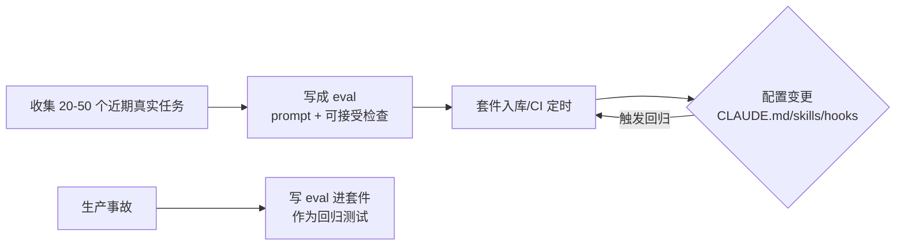

# 持续评估

## 运行机制

## 核心结论
- **Evals 是 AI-native 版的 stage-gate QA**：一套在 agent 配置变化（换模型、重写 prompt）时自动运行的套件，回答"agent 是否仍按同一标准干活" [[The AI-Native SDLC playbook]]。
- evals 是**活的套件**：模型变强后，曾能区分的用例失去区分度，需从持续监控中补充新用例。
- **每个生产事故都要沉淀一个 eval**，由事故团队撰写并留在套件里充当该问题类的回归测试——防止再次出现。

## 要点拆解
- **取材**：平台工程师从近期工作收集 20~50 个**真实任务**（含期望/可接受结果），远比合成用例贴近现实。
- **单条 eval**＝prompt + 判定"可接受"的检查（测试通过、lint 干净、行为不变、政策被遵循）[[The AI-Native SDLC playbook]]。
- **触发时机**：CI 定时 + **任何对 `CLAUDE.md`/`.claude/**`（skills/hooks）的变更**——这些配置导向 agent，值得享受代码享有的回归测试；有些团队偏好离线按节奏跑。
- **门槛化**：pass-rate 作为 merge check 执行；skill 变更拉低通过率会被拦下并评审；运行留日志，跨期可比较；结果由拥有该配置的团队审批。

## 相关页面
- [[Agent反馈闭环]]：任务级自查 vs 配置级回归的关系
- [[Skills技能]] / [[CLAUDE记忆文件]] / [[Hooks护栏与审批门]]：被 eval 守护的配置对象
- [[AI-native-SDLC]]：evals 在 QA 环节的位置

## 参考来源
- [[The AI-Native SDLC playbook]]