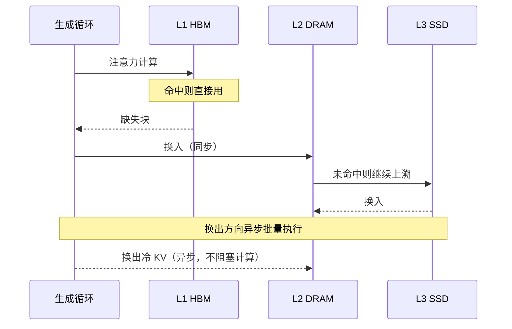

# 换入换出与数据迁移

## 核心结论

换入换出回答「怎么搬」。关键设计是**把迁移与计算解耦**：换出异步批量、与计算重叠，换入同步但可批量摊薄，从而把带宽成本压到可接受区间。

## 两个方向

| 方向 | 路径 | 触发时机 | 执行方式 |
|------|------|----------|----------|
| 换出 | HBM → DRAM/SSD | 生成过程中调度 | 异步批量，不阻塞计算 |
| 换入 | DRAM/SSD → HBM | token 被注意力访问时 | 同步执行 |

## 两个优化手段

- **批量搬运**：累积至一定批量后统一迁移，摊薄每次搬运的固定开销。
- **异步执行**：换出操作与计算重叠，隐藏迁移延迟。

## 常见问题

- **换出带宽瓶颈**：SSD 带宽仅数 GB/s，需控制换出频率。
- **延迟抖动**：驱逐与换入时机不稳定导致 TPOT 毛刺。

## 相关页面

- [[KV Cache分级存储]]：换入换出所属的总体机制
- [[三级存储金字塔]]：搬运的源层与目标层
- [[驱逐策略]]：决定换出哪些数据
- [[预取机制]]：把换入从「访问时」提前到「预测时」
- [[代表项目对比]]：vLLM 页级换出 vs FlexGen 线性规划调度

## 参考来源

- [[raw/papers/KV Cache分级存储.md]]