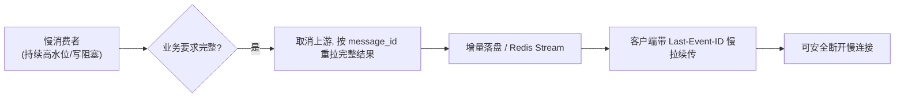

# 断线续传

## 核心结论

- **断线续传是慢消费者激进处置的前提**：没有续传兜底就不敢断开慢连接，内存会持续承接慢消费者；有了续传，可以把"内存里扛住慢消费者"转化为"随时安全断开慢消费者"。
- 实现方式：会话内容**增量落盘**（Redis/DB、Redis Stream），客户端携带**Last-Event-ID**或提交**offset**从断点续传。
- SSE带`id:`字段即可利用Last-Event-ID实现服务端断点记录；流结束/断开后客户端用该ID重新建立连接。

## 与慢消费者处置的关系

## 相关页面
- [[慢消费者处置]]：第三层——断线续传使其激进处置成为可能
- [[SSE背压与内存治理总览]]：五层框架全局视角
- [[SSE流式容错]]：SSE重试/中断策略（续传与"已输出即中断不重试"需区分场景）

## 参考来源
- [[raw/papers/面向SSE流式转发的背压与内存治理研究.md]]