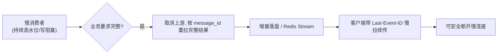

# 断线续传

## 核心结论

- **断线续传是慢消费者激进处置的前提**：没有续传兜底就不敢断开慢连接，内存会持续承接慢消费者；有了续传，可以把"内存里扛住慢消费者"转化为"随时安全断开慢消费者"。
- 实现方式：会话内容**增量落盘**（Redis/DB、Redis Stream），客户端携带**Last-Event-ID**或提交**offset**从断点续传。
- SSE带`id:`字段即可利用Last-Event-ID实现服务端断点记录；流结束/断开后客户端用该ID重新建立连接。

## 与慢消费者处置的关系

```mermaid
flowchart LR
    SLOW["慢消费者<br/>(持续高水位/写阻塞)"] --> DEC{"业务要求完整?"}
    DEC -->|"是"| CANCE["取消上游, 按 message_id 重拉完整结果"]
    CANCE --> DISK["增量落盘 / Redis Stream"]
    DISK --> REJ["客户端带 Last-Event-ID 慢拉续传"]
    REJ --> SAFE["可安全断开慢连接"]
```

## MCP 的对照案例：Last-Event-ID 被移除

- 经典 Streamable HTTP（2025-11-25）同样用 `Last-Event-ID` 从断点重放 SSE 事件；
- 但 MCP 2026-07-28 无状态重构**删除了该传输层机制**——响应流一旦中断，正在进行的请求结果即告丢失，客户端必须以新 JSON-RPC 请求 ID 重发，恢复责任下沉应用层（幂等键 + tasks 任务句柄），见 [[Streamable HTTP]]；
- 启示：续传能力需要传输层或应用层**显式支持**，不会自动存在；协议演进时该能力可被整体移除，接入方须关注版本差异。

## 相关页面
- [[慢消费者处置]]：第三层——断线续传使其激进处置成为可能
- [[SSE背压与内存治理总览]]：五层框架全局视角
- [[SSE流式容错]]：SSE重试/中断策略（续传与"已输出即中断不重试"需区分场景）
- [[Streamable HTTP]]：MCP 场景下 Last-Event-ID 的应用与 2026 移除对照
- [[重试预算与幂等保护]]：续传缺失后应用层重试的约束体系

## 参考来源
- [[raw/papers/面向SSE流式转发的背压与内存治理研究.md]]
- [[raw/papers/Streamable HTTP.md]]：MCP 经典版 Last-Event-ID 重连与 2026 移除