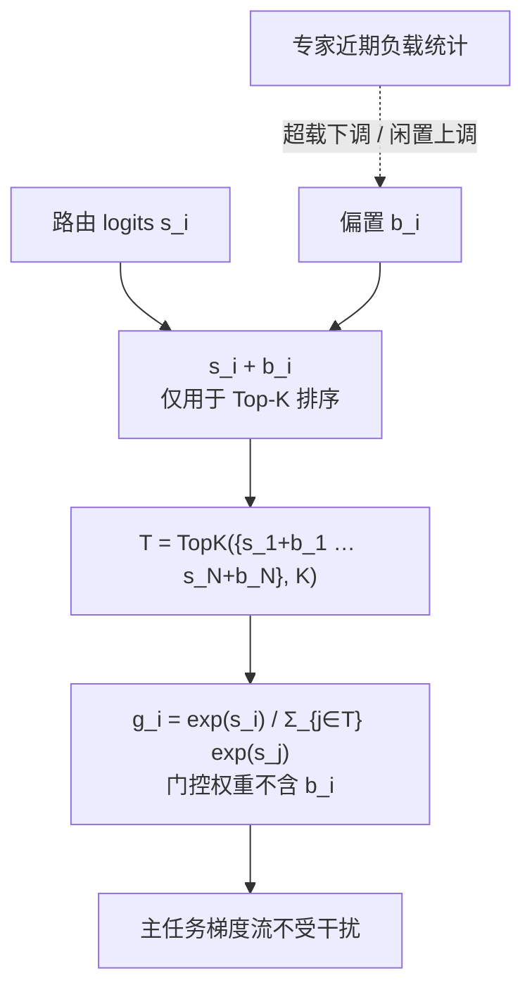

# 无辅助损失的专家偏置

## 排序与加权的分离

## 核心结论

DeepSeek-V2 首次提出**辅助损失无关**的均衡策略，DeepSeek-V3 将其规模化落地。做法是给每个专家维护一个偏置 $b_i$，**只在 Top-K 排序阶段使用，不进入门控权重**：

$$
\mathcal{T} = \mathrm{TopK}\big(\{s_1 + b_1, \dots, s_N + b_N\}, K\big), \qquad g_i = \frac{\exp(s_i)}{\sum_{j \in \mathcal{T}} \exp(s_j)}
$$

注意两处 $s_i$ 的差别：**排序用 $s_i + b_i$，加权只用 $s_i$**。

## 动态调节规则

训练中按专家的**近期负载统计**动态调节 $b_i$：

- 超载专家的 $b_i$ **下调**
- 闲置专家的 $b_i$ **上调**

由于 $b_i$ 不参与加权，**主任务的梯度流完全不受干扰**，实现了均衡与模型质量的兼得——这正是 [[辅助均衡损失与Router z-loss]] 中干扰梯度问题的反面。

局限在于**偏置更新节奏需要调**：调得太频繁会抖动，太慢则追不上负载漂移。

## 与整体的关系

DeepSeek-V3 的「671B 总参 / 37B 激活」能在 2.788M H800 GPU 小时内训完，与本策略同 [[细粒度专家切分与共享专家]] 一起构成其架构层的三项核心创新之一。该策略在 [[路由范式谱系]] 的均衡方法表中对应「无梯度干扰」那一行。

## 相关页面

- [[辅助均衡损失与Router z-loss]]：与本策略互补的加正则路线。
- [[路由坍缩与赢家通吃]]：负载失衡的根因。
- [[细粒度专家切分与共享专家]]：DeepSeek 系架构创新的另一半。
- [[路由范式谱系]]：七种均衡方法的横向对比。

## 参考来源

- [[raw/papers/MoE.md]]
