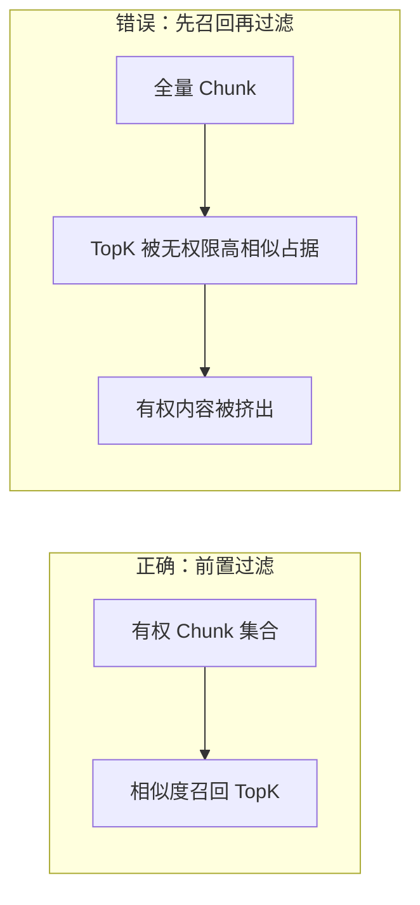

# 检索漏斗坍塌

## 核心结论

- **定义**：先召回全部相似 Chunk 再在业务层剔除无权限数据，导致无权限高相似文档抢占 TopK 名额、有权限内容被挤出的现象。
- **后果**：召回质量下降（有效内容变少）+ 泄露风险（无权限数据曾被召回）。
- **正确做法**：过滤逻辑下推到向量引擎层，在相似度计算前先过滤。

## 要点拆解

### 对比示意

图 1 检索漏斗坍塌对比图

### 坍塌机制
1. 无权限文档与查询高度相似（如同一主题的不同密级文档）
2. 先召回时，这些无权限文档占据 TopK 名额
3. 业务层过滤后，有权限但相似度稍低的文档已被挤出
4. 最终召回结果中有效内容变少，且无权限数据曾进入召回列表

## 相关页面

- [[检索前置过滤机制]]：正确的前置过滤机制
- [[RAG权限隔离全链路架构]]：全链路架构中的检索层
- [[向量库metadata过滤能力对比]]：向量库过滤能力差异

## 参考来源

- [[raw/papers/RAG知识库权限隔离.md]]
