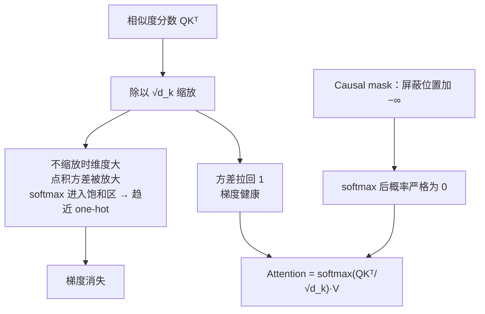

# 注意力缩放与因果掩码

## 两个配套设计

## 核心结论

$$
\text{Attention}(Q, K, V) = \text{softmax}\!\left(\frac{QK^\top}{\sqrt{d_k}}\right)V
$$

softmax 把 query 与 key 的相似度分数**归一化为和为 1 的权重**，再对 V 加权求和。两个配套设计都直接源于 softmax 的特性：

- **除以 $\sqrt{d_k}$**：维度大时点积分差过大，会把 softmax 推入**饱和区**（趋近 one-hot、梯度消失）；缩放把方差拉回 1，保持梯度健康。
- **Causal mask**：屏蔽位置加 $-\infty$，softmax 后概率**严格为 0**——「看不到未来」的数学表达。

第二条正是 [[Softmax数值稳定性]] 中减 max 思路的反向运用：同样利用指数对极端值的处理方式，一个用来防溢出，一个用来做硬屏蔽。

## 相关页面

- [[自注意力机制]]：缩放点积注意力的完整计算流。
- [[Softmax数值稳定性]]：指数与 −∞、减 max 的数值行为。
- [[Transformer解码器结构]]：上三角掩码的结构位置。
- [[温度参数与生成采样]]：另一个作用在 logits 上的调节旋钮。

## 参考来源

- [[raw/papers/Softmax.md]]
