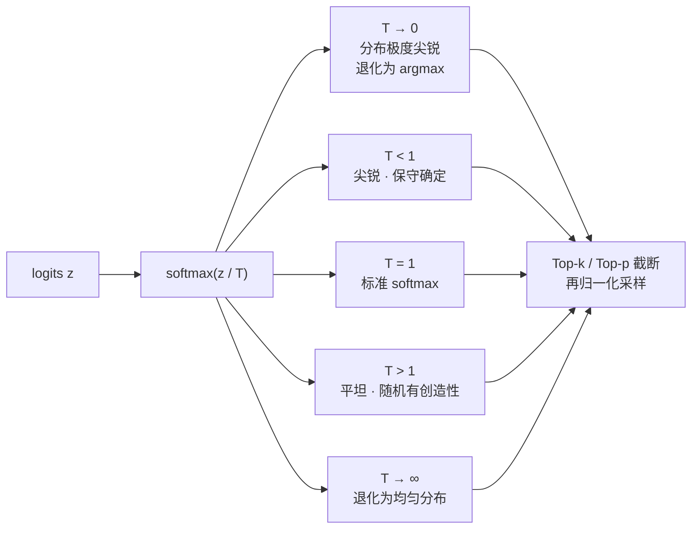

# 温度参数与生成采样

## 温度的调节谱系

## 核心结论

自回归生成时，每一步对整个词表做一次 softmax，得到下一个 token 的概率分布，再从中采样。**所有解码参数都作用在 softmax 的输出之后**。

**温度 T** 作用在 logits 上：$\text{softmax}(z/T)$。除以 T 会改变分布的尖锐程度——$T<1$ 分布尖锐（保守确定），$T>1$ 平坦（随机有创造性）；**$T \to 0$ 退化为 argmax，$T \to \infty$ 退化为均匀分布**，一个旋钮控制全部谱系。

**Top-k / Top-p** 只保留概率最高的 k 个、或累计概率达 p 的最小集合，再归一化采样，防止选中低质量词。**温度 + top-p 是生产环境最常见组合**。

## 与其它页面的分工

| 手段 | 作用位置 | 治什么 |
|---|---|---|
| 温度 T | softmax 之前的 logits | 调分布形状（尖锐↔平坦） |
| Top-k / Top-p | softmax 之后的概率 | 截断长尾低质量词 |
| 因果掩码 | softmax 之前的分数 | 屏蔽未来位置，见 [[注意力缩放与因果掩码]] |

高温在知识蒸馏里另有用途：软化 teacher 输出、传递「暗知识」，属于 [[Softmax变体族谱]] 中的控尖锐度一支。

## 相关页面

- [[Softmax归一化原理]]：被温度缩放的那个函数本体。
- [[Softmax候选方案对比]]：温度把 argmax 与均匀分布连成一条谱系。
- [[Softmax变体族谱]]：高温软化在蒸馏中的复用。
- [[Softmax技术全景总览]]：「在哪」这一段的落点之一。

## 参考来源

- [[raw/papers/Softmax.md]]
