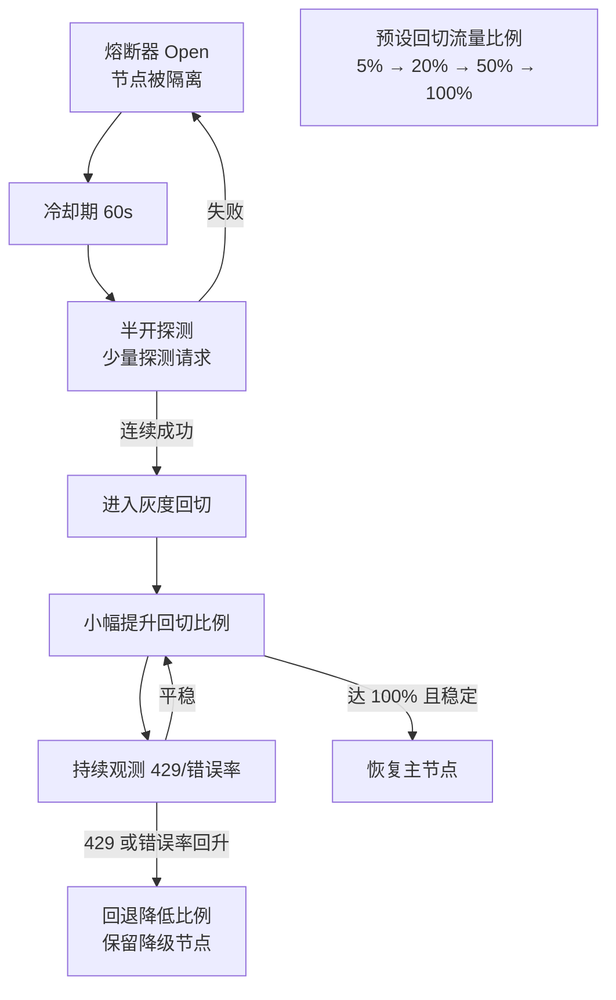

# 灰度回切

## 回切过程

## 核心结论
- 半开探针**连续多次成功**判定节点恢复，但**不会一次性全量切回流量**。
- 采用**渐进式灰度机制**：逐步将流量从降级备选模型迁回原主节点，每次小幅提升比例，持续观测 429 与错误率指标。
- 目的：**防止瞬间流量冲击再次触发限流/熔断**——被隔离的节点往往正处于脆弱的配额/负载边缘，全量灌回等于复辟事故。
- 若回切过程中指标回落，则降低比例、保留降级路径，等稳定后再继续。

## 要点拆解

### 为什么半开成功还不够
探测是少量低压力请求，验证的是「节点还活着」；全量请求的并发冲击和 429 配额消耗远超探测压力。从「活着」到「能扛全量」之间必须有观测窗口，灰度回切正是这个窗口的工程化。

### 与经典熔断器相比
经典模式探测成功直接 Closed 全量恢复；本文在 Closed 前插入渐变放量阶段，把「熔断→恢复」的陡变改为缓坡，属于 LLM 配额场景对 Fowler 熔断模式的适配。

### 观测指标
回切过程中紧盯两类信号：**429 频率**（配额是否被重新打满）与 **5xx 错误率**（节点是否真正恢复稳定），两者回升都触发回退。

## 相关页面
- [[熔断器状态机]]：回切的前置状态机
- [[429流量治理]]：回切必须监测的配额信号
- [[能力标签驱动降级]]：回切期间的降级备选仍在场

## 参考来源
- [[raw/papers/面向大模型服务的动态路由与流量治理架构研究.md]]