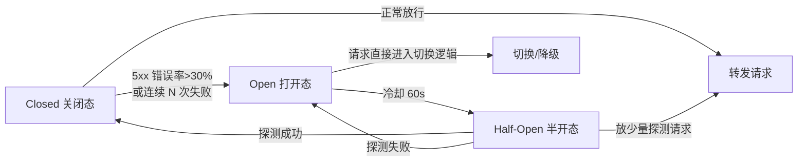

# 熔断器状态机

## 状态机图

## 核心结论
- 为每个上游模型节点维护**独立熔断器**，**仅统计 5xx 错误率**——429 属于配额信号，归 [[429流量治理]] 配额通道，不并入熔断统计，避免「每次 429 都切节点导致熔断计数永不触顶」和「429 误触发硬熔断」。
- 三态逻辑：**Closed**（放行）→ 滑动窗口 5xx 错误率 >30% 或连续 5 次失败 → **Open**（隔离节点，请求直接进切换逻辑）→ 冷却期（如 60s）后 **Half-Open**（放少量探测）→ 成功回 Closed / 失败回 Open。
- **SSE 以请求发起时刻计入统计**，而非流结束时刻，避免长耗时流式请求延迟错误上报。
- 恢复走 [[灰度回切]]：半开探测连续成功也不会全量切回，渐进放量观测。

## 要点拆解

### 为什么只认 5xx
上游返回 429 表示「服务正常、只是配额不够」，重试/切换有效；5xx 表示「服务端故障」，继续打只会加重雪崩，必须真正隔离。两类信号语义不同，混在一起统计会导致错误决策。

### Open 期间请求去哪
进入 `SwitchLogic` 切换逻辑：有备用节点 → 同模型换 Key / 异构降级；无备用 → 退避重试（见 [[重试预算与幂等保护]]）。

### 与经典 CircuitBreaker 的差异
经典模式（Fowler 的 CircuitBreaker）只盯失败率对单后端隔离；这里在每个上游节点上部署独立熔断器，并把统计口径做了通道分离（5xx vs 429），适配 LLM 配额限流的特殊性。

## 相关页面
- [[429流量治理]]：与 5xx 通道并列的另一半
- [[灰度回切]]：Half-Open 恢复的渐进放量
- [[能力标签驱动降级]]：Open 后的降级候选筛选
- [[双层网关架构]]：熔断器所在 AI 网关层

## 参考来源
- [[raw/papers/面向大模型服务的动态路由与流量治理架构研究.md]]