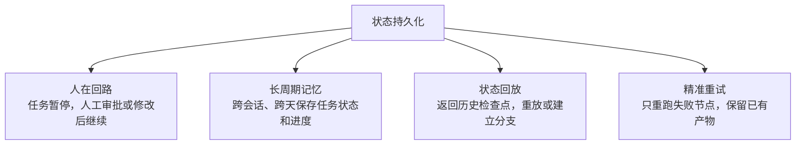

# 状态持久化四能力

## 四能力结构图

## 核心结论

- **状态落盘不是可选项**：它带来四种生产必需的能力，缺一不可上线。
- 这四项正是单体 Loop 缺失的**停（暂停）、回（恢复）、审（审计定位）** 能力的正向实现。
- 是可靠性三原则中「**状态可恢复**」的展开，也是 Graph 四要素中 **S（状态）** 的生命周期保障。

## 要点拆解

1. **人在回路（Human-in-the-Loop）**：任务暂停，人工审批或修改后继续
   - 对应生产四能力的「停｜暂停」+「人｜审批」
2. **长周期记忆**：跨会话、跨天保存任务状态和进度
   - 支撑三问判断法中"生命周期"一问的正向答案
3. **状态回放**：返回历史检查点，重放或建立分支
   - 对应「审｜审计」的定位能力，可追溯每次节点状态
4. **精准重试**：只重跑失败节点，保留已有产物
   - 把失败控制在最小范围，避免整体重跑的 Token 浪费

### 与整任务重试的对比

| | 整任务重试 | 精准重试（节点级） |
|--|------------|--------------------|
| Token 成本 | 高 | 低 |
| 用户体验 | 全部重来 | 保留已生成产物 |
| 实现 | 简单 | Checkpointer + 检查点 |

## 相关页面

- [[LangGraph与Checkpointer工作流]]：PostgreSQL Checkpointer 的工程落地
- [[Agent生产落地实践]]：可靠性三原则之「状态可恢复」
- [[共享状态驱动协作]]：状态在节点间的协作语义
- [[Graph图编排架构]]：S 状态要素的定义
- [[单体Loop结构性瓶颈]]：Loop 侧四能力缺口（本页是正向解法）
- [[输出验证与人工审批]]：人在回路的分级审批形式

## 参考来源

- [[raw/articles/Loop之后为什么是Graph.md]]
