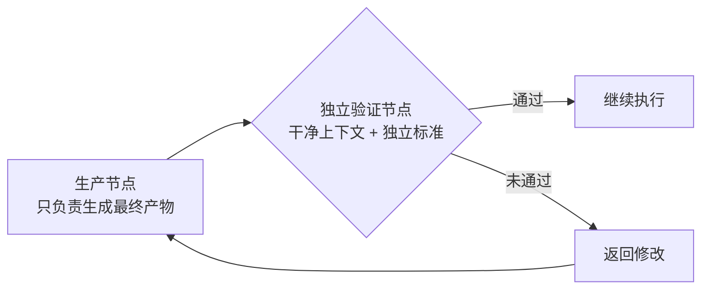

# 独立验证机制

## 验证流程图

## 核心结论

> **别让一个节点既写答案，又批卷子。**

- **生产节点**只负责生成最终产物；**独立验证节点**使用干净上下文和独立标准，**验证结果，而不是重复生成者的推理过程**。
- 验证不通过则**返回修改**，构成闭环，而不是靠生成节点自查。
- 这是可靠性三原则中「**验证独立化**」的落地形式，直接解决单体 Loop 的**错误级联**与**自写自审**问题。

## 要点拆解

### 职责分离

流程：**生产节点 → 独立验证节点**

| 节点 | 职责 | 关键约束 |
|------|------|----------|
| 生产节点 | 只负责生成最终产物 | 不做自我终审 |
| 独立验证节点 | 用干净上下文 + 独立标准验证 | 验证结果而非重复推理过程 |

- **通过**：继续执行
- **未通过**：返回修改

### 三种拆分模式

1. **对抗式验证（攻）**：从反方视角寻找假设漏洞、边界条件和反例
2. **多视角验证（多）**：分别检查逻辑、安全、事实来源和可复现性
3. **评审制（评）**：多个方案并行生成，再按照统一标准评分选优

### 与其他机制的关系

- 与 [[输出验证与人工审批]] 互补：独立验证解决"结果对不对"，输出侧闸门解决"输出能不能滑出系统边界"。
- 与 [[单体Loop结构性瓶颈]] 对应：是拦截"错误变成新前提"放大回路的直接手段。
- 与 [[古德哈特目标偏移]] 相关：独立标准对照真实业务结果，防止指标与目标脱节（见 [[单体Loop结构性瓶颈]] 目标偏移小节）。

## 相关页面

- [[Agent生产落地实践]]：可靠性三原则之「验证独立化」
- [[Loop与Graph选型对比]]：方案B 审稿人节点的案例应用
- [[输出验证与人工审批]]：输出侧分级审批闸门
- [[Agent反馈闭环]]：让 agent 自己验证工作的机制
- [[持续评估]]：把验证固化为可回归的 eval 套件

## 参考来源

- [[raw/articles/Loop之后为什么是Graph.md]]
