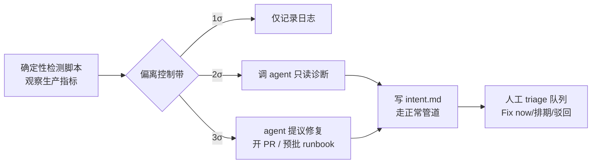

# 监控闭环

## 分级响应模型

## 核心结论
- **闭环 = 自主运行 SDLC**：确定性脚本（无模型参与）监控生产指标，破 control band 时按 σ 分级触发 Claude：1σ 仅记日志、2σ 只读诊断、3σ 可提案修复（开 PR 进 review 或触发预批 runbook）[[The AI-Native SDLC playbook]]。
- agent 产出 `intent.md`（异常与证据、建议结果、影响系统、未决问题），之后**走正常的承交付物管道**——闭环是"把入口也自动化"，而非绕开既有 gate。
- 另一入口 **Claude Tag**（public beta，Slack）：以自有身份成为频道成员做一线响应；对话与制度知识留在频道，请求/诊断/人类授权/修复都在频道留痕，**频道即审计** [[The AI-Native SDLC playbook]]。

## 要点拆解
- **检测层全确定性**：选取有稳定滚动基线的指标（CI 测试失败率、post-deploy 5xx、PR cycle time），均值±std（Western Electric 类规则）同时抓尖峰与慢漂移；脚本版本化、单测、无模型参与。
- **tier 配置**：`bands.yaml` 定义分级动作与工具权限（2σ 只给 Read/Grep/Bash 只读，3σ 只给 PR/预批 runbook 路由）；边界由版本化 config + managed settings + 权限回绝生产直连，调用/发现/triage 都打时间戳留日志。
- **运行形态**：stateless 非交互，CI runner 或沙箱容器中的 Agent SDK 服务，闭环可无人开启即启停；瓶颈时预演回滚（rollback 是全管道最该排练的路径）。
- **triage 职责**：service owner / on-call 工程师把队列路由给产品 owner 或调度（Fix now/排期/驳回）；驳回反过来校准 band 降噪。
- **事故沉淀**：fix 落地后为该事故补 eval（[[持续评估]]），确保问题类被守护。
Claude Tag 场景：@ 在 ticket 上亦按同法处理——小改动走 PR gate，大改动写 intent.md 进 Plan [[The AI-Native SDLC playbook]]。

## 相关页面
- [[committed-artifact]]：闭环从 intent.md 开始走整条管道
- [[AI-native-SDLC]]：Maintain 阶段在六阶段中的位置
- [[持续评估]]：事故落地为回归 eval
- [[AI代码评审]]：修复进 PR review gate

## 参考来源
- [[The AI-Native SDLC playbook]]