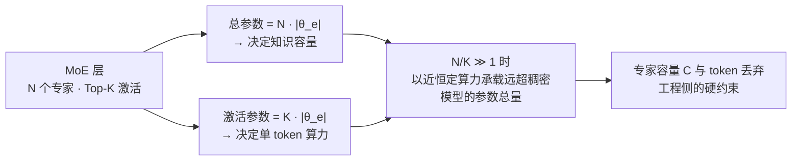

# 稀疏激活与容量解耦

## 解耦关系

## 核心结论

MoE 的核心价值是把两个原本绑定的量分离：

$$
\underbrace{|\theta_{\text{total}}| = N \cdot |\theta_e|}_{\text{总参数} \to \text{知识容量}}, \qquad \underbrace{|\theta_{\text{active}}| = K \cdot |\theta_e|}_{\text{激活参数} \to \text{单token算力}}
$$

模型能「记住」多少由 $N$ 决定，单次前向 FLOPs 只由 $K$ 决定。当 $N/K \gg 1$ 时，MoE 就能在近恒定算力下承载远超同规模稠密模型的参数总量。

## 代表模型参数对比

| 模型 | 总参数 | 激活参数 | 激活比例 | 路由策略 |
|---|---|---|---|---|
| Mixtral 8×7B | 46.7B | 12.9B | ~28% | 8 选 2 |
| DeepSeek-V3 | 671B | 37B | ~5.5% | 256 选 8 + 1 共享 |
| Switch Transformer | 1.6T | 每层 FFN 仅激活 1/2048 | — | 2048 选 1 |
| ST-MoE-32B | 269B | ≈32B 稠密等算力 | — | Top-2 |

**越往大走，激活比例越低**——这正是「容量翻倍、算力打折」的量化体现，完整边界见 [[MoE与稠密模型对比]]。

## 专家容量与 token 丢弃

路由是动态的，各专家实际收到的 token 数会偏离均衡。为保证张量形状固定，GShard 引入**专家容量**：

$$
C = \left\lfloor \frac{B \cdot S}{N} \cdot \mathrm{CF} \right\rfloor
$$

$B$ 为 batch 大小、$S$ 为序列长度。**超出容量 $C$ 的 token 被丢弃**（通过残差连接直通），Switch Transformer 实证推荐 $\mathrm{CF} = 1.0\text{–}1.25$。丢弃本质上是把路由不均的代价转嫁成信息损失，因此 MegaBlocks 用块稀疏 GPU kernel 彻底取消容量约束与 token 丢弃，端到端训练加速最高 40%。

## 相关页面

- [[门控路由与Top-K稀疏激活]]：$N$ 与 $K$ 在门控公式中的位置。
- [[路由坍缩与赢家通吃]]：让 token 分布偏离均衡、进而触发丢弃的根因。
- [[MoE与稠密模型对比]]：解耦收益的适用边界——小规模反而不划算。
- [[显存墙]]：与 KV Cache 侧同名的容量约束，MoE 侧的对应页面是 [[MoE显存墙与量化压缩]]。

## 参考来源

- [[raw/papers/MoE.md]]
