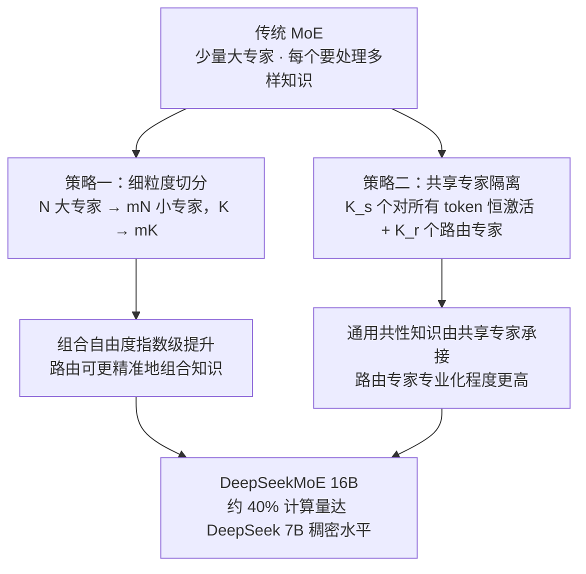

# 细粒度专家切分与共享专家

## 两项策略的组合

## 核心结论

传统 MoE 使用少量大专家，每个专家需处理多样化的知识类型，**专业化受限**。DeepSeekMoE 提出两项互补策略。

### （1）细粒度专家切分

将 $N$ 个大专家拆为 $mN$ 个小专家，激活数从 $K$ 增至 $mK$。以 $N=4, K=2$ 为例，传统 Top-2 组合数为 $\binom{4}{2}=6$，切分后为 $\binom{8}{3}=56$，**组合自由度指数级提升**，路由可更精准地组合知识。

### （2）共享专家隔离

设置 $K_s$ 个对所有 token 都激活的**共享专家**承接通用共性知识，其余 $K_r$ 个路由专家通过门控选择性激活，避免路由专家重复学习共性知识：

$$
h'_t = \sum_{i=0}^{K_s - 1} \mathrm{FFN}_{s_i}(h_t) + \sum_{i=1}^{K_r} g_{i,t} \cdot \mathrm{FFN}_i(h_t)
$$

## 实证效果

**DeepSeekMoE 16B 仅用约 40% 的计算量即达到 DeepSeek 7B 稠密模型的水平**，并超过参数量约 2.5 倍的 LLaMA2 7B。DeepSeek-V3 的「256 选 8 + 1 共享」正是这一路线的规模化版本，与其并列的还有 [[无辅助损失的专家偏置]]。

注意细粒度切分同时改变了 [[稀疏激活与容量解耦|激活比例]]：小专家更多、单专家更小，同样的总参数下 FLOPs 更易摊薄。

## 相关页面

- [[门控路由与Top-K稀疏激活]]：$K$ 如何随切分从 $K$ 增至 $mK$。
- [[无辅助损失的专家偏置]]：DeepSeek 系架构创新的另一半。
- [[稀疏激活与容量解耦]]：切分对激活参数与容量的影响。
- [[路由坍缩与赢家通吃]]：专业化提升对通吃空间的抑制。

## 参考来源

- [[raw/papers/MoE.md]]
