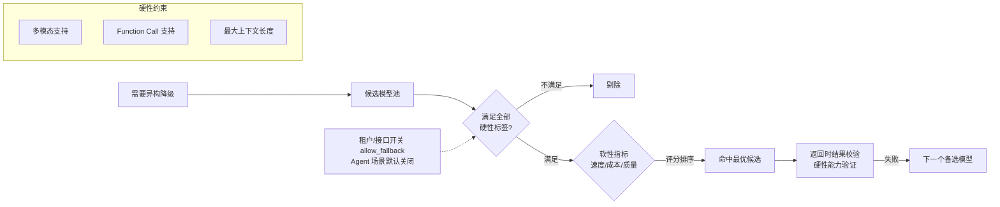

# 能力标签驱动降级

## 降级候选筛选

## 核心结论
- 降级顺序固定：**同模型换 Key（故障转移）优先 → 异构模型降级兜底**；异构降级必须走**能力标签体系**筛选，杜绝「降级到不支持 Function Call 的模型导致 Agent 工具调用报错」。
- 标签分层：**硬性约束**（多模态、Function Call 支持、最大上下文长度）必须全部满足；**软性约束**（推理速度、成本、输出质量）可放宽并按评分选优。
- 控制开关：`allow_fallback` 支持租户/接口粒度控制，**Agent 工具调用场景默认关闭自动异构降级**，防函数调用格式不兼容。
- 降级反馈：成功降级在响应头打 `X-Downgraded: true` 与 `X-Fallback-Model`，供上层业务感知决策。

## 要点拆解

### 多 vs 传统静态映射
LiteLLM/Portkey 的降级多是硬编码「A→B」映射，不含能力校验。引擎若把 Agent 的任务降级到无 Function Call 的模型，工具调用直接失败——比不降级更糟。能力标签把「能不能干这活」提为前置门槛。

### 硬/软约束分工
硬性标签是资格线（不行就淘汰），软性指标是择优线（行就排序）。硬性优先保证语义正确，软性优化成本与体验。

### 结果校验形成闭环
异构降级后做轻量级结果校验（如 Function Call 是否返回合法 tool_call 结构），失败自动尝试下一个备选，防止降级模型「装能用但不可用」。

## 相关页面
- [[熔断器状态机]]：触发降级的 5xx 场景
- [[429流量治理]]：触发降级的配额场景
- [[双层网关架构]]：降级发生在 AI 网关路由层
- [[LLM网关动态路由与流量治理总览]]：降级在调度体系中的位置

## 参考来源
- [[raw/papers/面向大模型服务的动态路由与流量治理架构研究.md]]