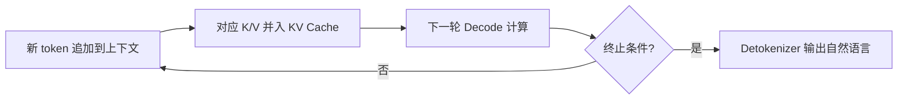

# 自回归迭代与终止

## 核心结论

生成的 token id 被追加到上下文末尾，作为下一轮 Decode 的输入，同时对应的 K/V 也并入 KV Cache，进入下一轮计算。该循环持续到以下任一条件触发。

## 终止条件

1. 命中 **stop token / EOS**（如 `<|end▁of▁sentence|>`）
2. 达到 `max_new_tokens` 硬上限
3. 命中自定义停止字符串

## 要点拆解

### 为什么用 tokens/s 衡量

每个 token 都是一次完整的 Decode 步骤，输出越长总耗时越线性增长。生成速度用 tokens/s（TPOT）衡量。

### 迭代过程

### 与 Agent 循环的区别

- **自回归迭代**：模型内部逐 token 生成，终止条件由模型输出决定
- **Agent 循环**：LLM 与工具、上下文、harness 构成的执行环路，终止条件由任务完成度决定

详见 [[Agent循环]]、[[Agent循环终止与护栏]]。

## 相关页面

- [[Agent循环]]：Agent 层面的循环机制
- [[KV Cache]]：迭代过程中 K/V 的累积
- [[Prefill与Decode两阶段]]：Decode 阶段的串行特性
- [[大模型推理全链路]]：迭代在推理流水线中的位置

## 参考来源

- [[raw/papers/大模型推理全链路.md]]
