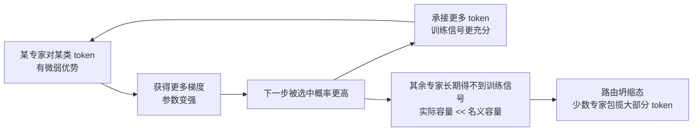

# 路由坍缩与赢家通吃

## 正反馈环

## 核心结论

路由器本质上是一个 **softmax 分类器**，而 softmax 天然具有排他性。训练早期只要某专家对某类 token 有微弱优势，就会获得更多梯度而变强，下一步被选中的概率更高，形成**「赢家通吃」正反馈**。

最终收敛到**路由坍缩**态：少数专家包揽大部分 token，其余专家长期得不到训练信号，实际容量远小于名义容量——此时 $N$ 个专家的容量优势全部失效，等于退化成一个更小的稠密模型。

## 与相邻问题的关系

| 现象 | 发生阶段 | 直接后果 |
|---|---|---|
| 路由坍缩 | 训练 | 专家利用率崩塌，容量收益消失 |
| token 分布不均 | 训练/推理 | 触发 [[稀疏激活与容量解耦|专家容量]] 超限与 token 丢弃 |
| 推理负载不均 | 推理部署 | 热点卡过载，需 [[MoE推理部署与冗余专家|冗余专家]] 兜底 |

三者同源——都来自路由器的动态选择——但发生阶段与治理手段不同。训练期的治理手段见 [[辅助均衡损失与Router z-loss]] 与 [[无辅助损失的专家偏置]]。

## 治理思路的分野

- **加正则**：把均衡写进损失函数（辅助均衡损失）或约束 logits 幅度（Router z-loss）。
- **不加正则**：偏置只参与 Top-K 排序、不进入门控权重，主任务梯度流完全不受干扰（DeepSeek-V2/V3）。
- **改范式**：Expert-Choice 由专家挑 token，天然不存在通吃。

三条路线的权衡见 [[路由范式谱系]] 的全景对比表。

## 相关页面

- [[辅助均衡损失与Router z-loss]]：第一、二种治理手段的公式与代价。
- [[无辅助损失的专家偏置]]：无梯度干扰的第三条路。
- [[细粒度专家切分与共享专家]]：从架构侧提高专业化程度、降低单专家的通吃空间。
- [[稀疏激活与容量解耦]]：坍缩让解耦收益失效的传导路径。

## 参考来源

- [[raw/papers/MoE.md]]
