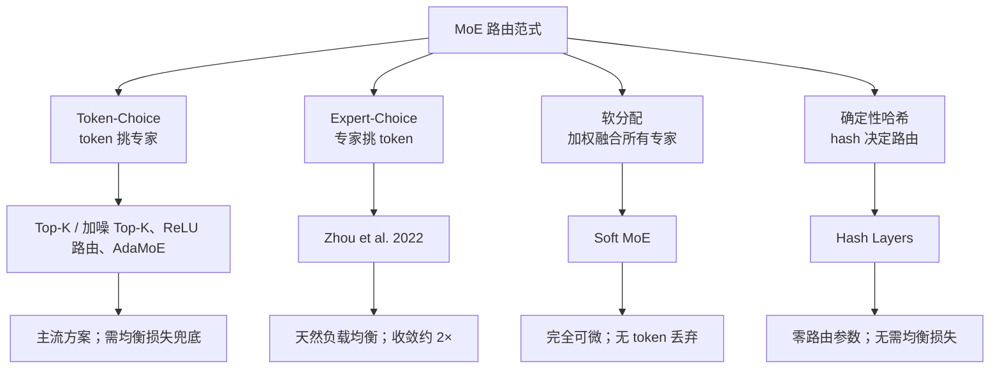

# 路由范式谱系

## 谱系结构

## 核心结论

路由方案按「谁挑谁」可分四大范式：**Token-Choice** 是主流（token 挑专家，但需均衡损失兜底）；**Expert-Choice** 反转方向由专家挑 token，天然负载均衡且收敛加速约 2 倍；**软分配**（Soft MoE）把二值选择换成对全部专家的加权融合，完全可微、无 token 丢弃；**确定性哈希**（Hash Layers）用 hash 直接定路由，零路由参数、无需均衡损失，但没有语义自适应能力。

## 两个变体

- **MMoE**（多任务场景）：为每个任务设置独立门控、共享同一专家池，通过门控差异建模任务相关性，缓解多任务学习中的负迁移，是推荐系统中的经典变体。
- **ReMoE**：以 ReLU 函数替代 TopK + Softmax，实现完全可微的路由，配合自适应 $L_1$ 正则控制稀疏性，在多种规模下优于 TopK 路由。

## 均衡方法全景对比

| 方法 | 机制 | 优点 | 局限 |
|---|---|---|---|
| 辅助均衡损失 | 附加正则项 $\alpha \cdot N \sum f_i P_i$ | 简单、成熟 | 干扰主任务梯度 |
| Router z-loss | 惩罚 logits 幅度 | 稳定训练 | 不直接解决均衡 |
| 专家偏置 | 偏置仅用于 Top-K 排序 | 无梯度干扰 | 偏置更新节奏需调 |
| Expert-Choice | 专家挑 token | 天然均衡，收敛 2× | token 处理数不定 |
| ReLU 路由 | 完全可微替代 TopK | 动态分配、可扩展 | 需 $L_1$ 正则 |
| Soft MoE | 软加权组合所有 token | 无丢弃、完全可微 | 大语言场景需适配 |
| Hash Layers | 哈希确定性路由 | 零路由参数 | 无语义自适应 |

其中前三行对应训练期正则手段，详见 [[辅助均衡损失与Router z-loss]] 与 [[无辅助损失的专家偏置]]；Expert-Choice 属于范式反转，Soft MoE 与 ReLU 路由分别对应软分配与可微改造。

## 相关页面

- [[门控路由与Top-K稀疏激活]]：Token-Choice 主流方案的数学形式化。
- [[辅助均衡损失与Router z-loss]]：表中前两行的公式与代价。
- [[无辅助损失的专家偏置]]：不加正则项的第三条路。
- [[路由坍缩与赢家通吃]]：这张表要解决的原始问题。

## 参考来源

- [[raw/papers/MoE.md]]
