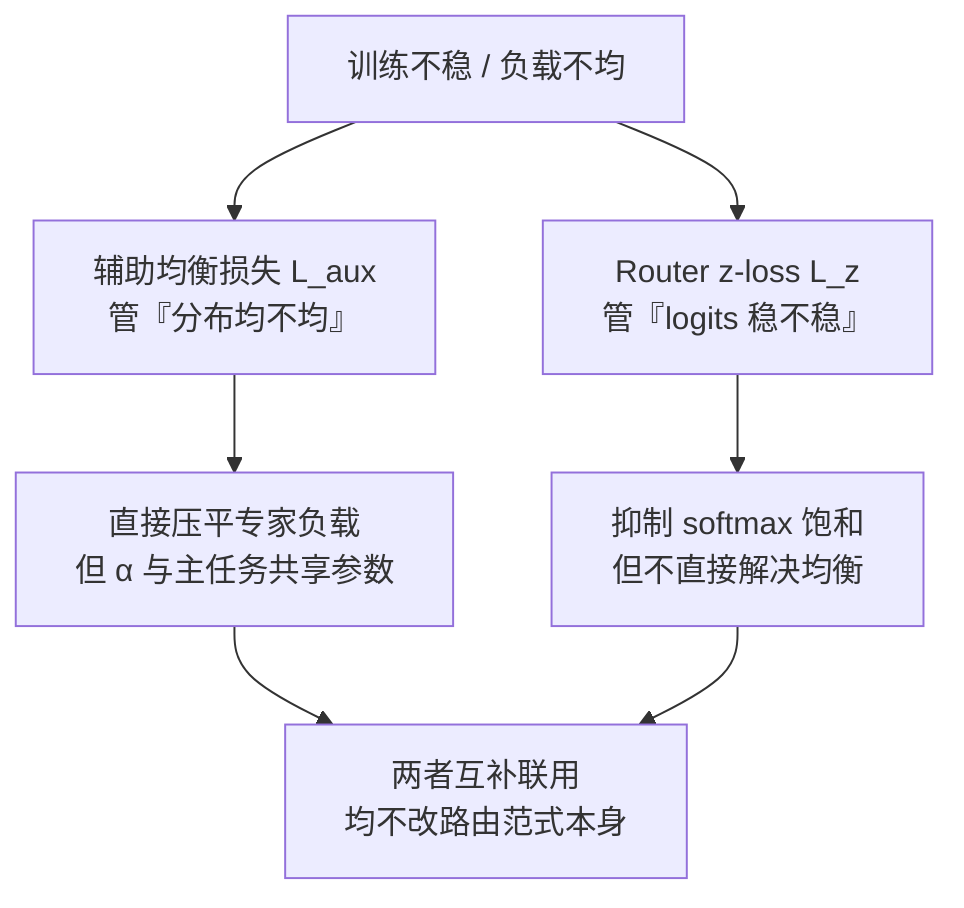

# 辅助均衡损失与Router z-loss

## 两个正则项的分工

## 核心结论

### 辅助均衡损失

GShard 与 Switch Transformer 把均衡问题转化为损失正则项。设 $f_i$ 为实际分配到专家 $i$ 的 token 比例，$P_i$ 为路由器分配给专家 $i$ 的平均概率：

$$
\mathcal{L}_{\text{aux}} = \alpha \cdot N \sum_{i=1}^{N} f_i \cdot P_i
$$

**$f_i$ 不可导、$P_i$ 可导并接受梯度**。当分布均匀时 $f_i = P_i = 1/N$，损失达最小值 1；分布越倾斜损失越大。代价是 $\alpha$ 与主任务共享参数，过大会产生**干扰梯度**损害模型质量。

### Router z-loss

ST-MoE 发现路由 logits 的数值幅度不稳定是训练崩溃的重要根源：

$$
\mathcal{L}_z = \frac{1}{B} \sum_{b=1}^{B} \left( \log \sum_{j=1}^{N} e^{s_j^{(b)}} \right)^2
$$

它惩罚 logits 的**整体幅度**、防止 softmax 饱和，与均衡损失互补使用——z-loss 稳的是训练，不直接解决均衡。

## 为什么还需要第三条路

两者都往损失里加项，只要 $\alpha$ 调不好就会与主任务抢梯度。DeepSeek-V2 因此提出**无辅助损失的均衡策略**，见 [[无辅助损失的专家偏置]]；[[路由范式谱系]] 的全景对比表把三种手段与 Expert-Choice、ReLU 路由、Soft MoE、Hash Layers 放在一起做了横向比较。

## 相关页面

- [[路由坍缩与赢家通吃]]：这两个损失要治的病。
- [[无辅助损失的专家偏置]]：不进损失函数的替代方案。
- [[路由范式谱系]]：七种均衡方法的机制、优点与局限对比。
- [[细粒度专家切分与共享专家]]：架构侧的互补手段。

## 参考来源

- [[raw/papers/MoE.md]]
