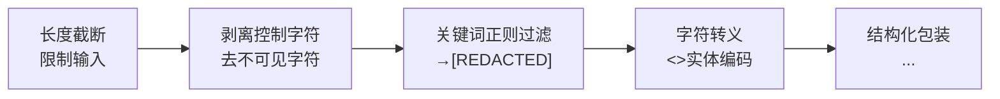
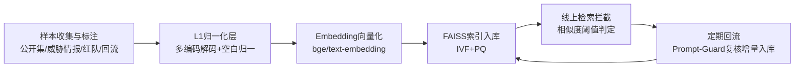

# 输入清洗与恶意指令向量库

## 核心结论

- 输入清洗是"安全前置"策略，纯正则无法 100% 防住复杂语义注入，但能挡住大量低成本、自动化的大规模注入[[1]](#ref-1)。
- 恶意指令向量库把"已知攻击指纹"沉淀为可语义检索知识库，用"查相似"替代"查精确匹配"，识别变体与混淆改写[[1]](#ref-1)。
- 清洗与向量库都只是 Pre-Model 层的一环，**必须纵深防御**：与系统提示词隔离、输出动作校验、工具权限管控、关键操作人工确认叠加[[1]](#ref-1)。

## 综合清洗管道

<b>图1 输入清洗管道</b>

### 关键维度

| 维度 | 做法 | 目标 |
|---|---|---|
| 关键词与模式屏蔽 | 黑名单正则替换为 `[REDACTED]` | 覆盖系统提示词词（ignore/disregard/forget） |
| 字符转义与结构化 | `<`→`&lt;`、`>`→`&gt;`；强制 JSON 包装 | 防恶意伪造 XML 标签破坏结构 |
| 控制字符剥离 | 移除不可打印字符、标准化空白 | 防零宽空格/Unicode 控制字符绕过 |
| 长度截断 | 输入限制字符数；检索只取 Top-K | 防长文本逻辑链注入；省 Token |
| 语义清洗 | LlamaGuard/BERT 分类器意图判断 | 正则不懂语义，需分类器兜底 |

正则常见匹配目标：`ignore (previous|all|above) instructions`、`disregard prior`、`act as`、`pretend to be`、`enter developer mode`、`system:`、`assistant:`、`</system>`、`<new_instruction>`。

## 恶意指令向量库

<b>图2 恶意指令向量库构建与运营闭环</b>

### 六步流程

1. **样本收集与标注**：公开数据集（prompt-injection-15k、agentic-prompt-injection-5k）+ 威胁情报采集（MITRE ATLAS、OWASP LLM Top 10）+ 红队自产（GCG、Many-shot、Base64）+ 线上拦截回流；**必须收集 hard negative** 防假阳性失控[[1]](#ref-1)。
2. **清洗归一化（L1 层）**：URL/Base64 decode、HTML unescape、Unicode normalize、不可见字符剥离——否则同一攻击多编码后成"新向量"污染库[[1]](#ref-1)。
3. **Embedding 选型**：通用相似度（bge-large-zh-v1.5、text-embedding-3-large）建库召回 + 专用分类器（Meta Prompt-Guard-2）二次确认，降低假阳性[[1]](#ref-1)[[2]](#ref-2)。
4. **向量化入库**：恶意指令通常几千到几万条，FAISS IVF+PQ 即可胜任；元数据（攻击族/技法/severity）与向量绑定供证据链追溯[[1]](#ref-1)。
5. **检索拦截**：清洗→向量化→top-K 相似检索→阈值判定。**阈值调参陷阱**：阈值是 Embedding 模型的属性而非数据属性，不同模型相似度分布不可横向比较；用真实流量画 benign/malicious 分布直方图选交叠最小点[[1]](#ref-1)。
6. **更新维护**：定期回流增量入库重建索引；依赖人工 `retrieval → 分类 → 复核 → 回流` 闭环[[1]](#ref-1)。

## 局限

- 向量库只能覆盖"已知模式及其变体"，对全新攻击家族（zero-day 注入）召回率断崖式下降；对抗演化（编码混淆、Unicode 隐形字符、语言切换、语义改写、多轮拆解）可绕过[[1]](#ref-1)。
- Prompt-Guard-2 实为**二分类**（benign/malicious），对话素材中"三分类 injection/jailbreak/benign"为 v1 旧口径，论文已按官方修正[[2]](#ref-2)。

## 相关页面

- [[提示词注入]]：威胁成因与分类
- [[LLM-Agent安全防护总览]]：输入侧在纵深防御中的位置
- [[向量数据库]]：FAISS/IVF/PQ 底层索引机制
- [[Embedding向量嵌入]]：向量化基础

## 参考来源

- [[raw/papers/LLM-Agent安全防护-提示词注入防御与权限最小化综合研究.md]]
- [[raw/articles/chatglm-防提示词注入方法.md]]

---

[1] ChatGLM 防提示词注入方法素材，见 [[raw/articles/chatglm-防提示词注入方法.md]]
[2] Meta. [Llama Prompt Guard 2（二分类 benign/malicious）](https://github.com/meta-llama/PurpleLlama/tree/main/Llama-Prompt-Guard-2)