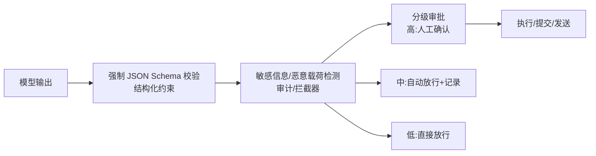

# 输出验证与人工审批

## 核心结论

- 输出侧验证不直接防盗注入，但保证"模型即使被说服，也不会让恶意输出滑出系统边界"——是纵深防御的**最后一道闸门**[[1]](#ref-1)。
- 高风险动作必须走**人类在环（Human-in-the-loop）审批**，且与工具侧[[工具调用零信任管控]]的 Fail Closed 形成双重兜底[[2]](#ref-2)。
- 全链路审计 + 定期对抗性测试，把防御从"单点拦截"升级为**可度量、可迭代的运营闭环**[[1]](#ref-1)。

## 输出侧验证机制

<b>图1 Agent 输出验证与审批流程</b>

- **强制 JSON Schema**：模型输出必须符合预定义结构（如函数名/参数列表/消息类型），非结构化自由文本风险高——从"听它说什么"变成"必须按格式提交"。
- **敏感信息检测**：输出中命中手机号/身份证/邮箱/密钥等 → 拦截并标记审计。
- **恶意载荷检测**：URL/代码/脚本等可能带执行副作用的载荷，人工审查后方可放行。

## 三级审批策略

| 风险等级 | 处置 | 示例 |
|---|---|---|
| 高风险 | 强制人工确认（人类在环） | 转账、写库、发信、删除、代码执行[[2]](#ref-2) |
| 中风险 | 自动放行 + 审计留痕 | 调外部 API、读取私有数据 |
| 低风险 | 直接放行 | 内部只读查询、文本生成 |

## 审计与运营

- **全链路审计日志**：记录请求、工具调用、输出、审批人/原因，形成可追溯的证据链，支撑对抗性测试复盘。
- **对抗性红队测试 CI/CD**：把已入库的恶意样本（含变体）固化进回归测试，模型/提示词/工具变更时自动回归（呼应[[持续评估]]思路）。
- **思维链缓冲**：必要时先看模型完整推理（chain-of-thought）再决定放行，防"动作看起来无害但推理链路被劫持"。

## 相关页面

- [[LLM-Agent安全防护总览]]：第⑤⑥层防御
- [[工具调用零信任管控]]：输入端工具侧兜底
- [[提示词注入]]：威胁源头
- [[Function Calling三阶段模型]]：Post-call 结果校验对齐

## 参考来源

- [[raw/papers/LLM-Agent安全防护-提示词注入防御与权限最小化综合研究.md]]
- [[raw/articles/doubao-LLM权限最小化落地.md]]

---

[1] 豆包/DeepSeek Agent 安全素材整合，见 [[raw/papers/LLM-Agent安全防护-提示词注入防御与权限最小化综合研究.md]]
[2] OWASP. [Substantial Abuse: High-risk actions require human approval](https://github.com/OWASP/www-project-top-10-for-large-language-model-applications/blob/main/2_0_vulns/LLM01_PromptInjection.md)