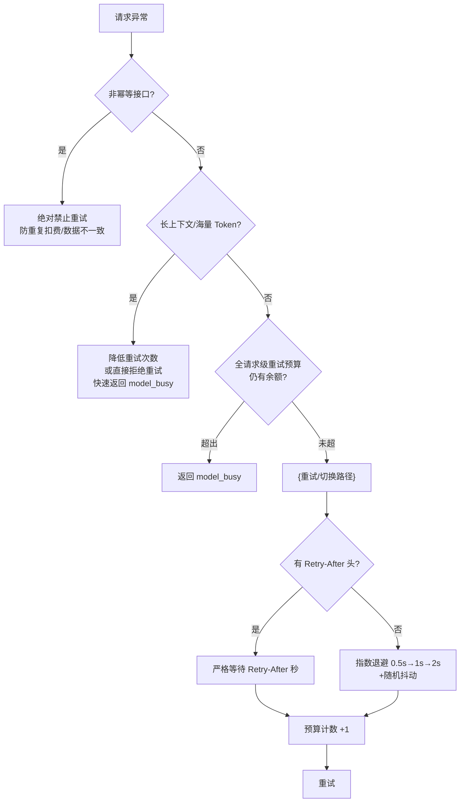

# 重试预算与幂等保护

## 重试决策流程

## 核心结论
- **统一重试预算**：5xx 重试、换节点、退避三个循环统一受请求级预算约束（如总外部重试 ≤3 次、换节点 ≤2 次），任一触顶即返回 `model_busy`——**防止长尾请求在多层循环间无限穿越**。
- **非幂等接口（计费/文件上传）异常绝对禁止重试**，防重复扣费或数据不一致。
- **长上下文大 Token 请求**重试成本极高且极易再撞 TPM → 降低重试次数甚至直接拒绝，快速返回 `model_busy`；预扣 Token 在触发重试前按请求 ID 全额退款，不挤占配额又不出结果。
- 退避规则：响应头 `Retry-After` → 严格等待；否则指数退避 + **随机抖动**（0.5s→1s→2s）——抖动是防惊群、防多并发同时醒来形成二次流量尖峰的关键。

## 要点拆解

### 为什么需要全请求级预算
换节点可以多次、5xx 有独立重试数、退避有循环计数——若三个循环各自为政，一个请求可在「换节点→5xx→退避→再换」间无限巡游，耗尽网关与上游资源。统一预算封顶是三者的总闸门。

### 非幂等为什么一刀切
计费接口重试 = 可能重复扣费；上传/文件接口重试 = 数据可能不一致。这类请求宁可快速失败交业务兜底，也不能用网络传输层的重试语义替业务做完整性保障。

### 抖动为何关键
指数退避让单请求等待时间翻倍变长，但**所有并发请求各自同步退避**后会在同一个时间点醒来——届时集群一起重发 = 二次尖峰。加随机抖动（±随机量）把并发唤醒打散，是分布式系统重试的标配。

## 相关页面
- [[429流量治理]]：月度配额用尽的「零重试」特例
- [[熔断器状态机]]：5xx 重试与熔断的衔接
- [[SSE流式容错]]：已流式输出非幂等场景
- [[RPM与TPM联合令牌桶]]：长上下文预扣 Token 的退款链路

## 参考来源
- [[raw/papers/面向大模型服务的动态路由与流量治理架构研究.md]]