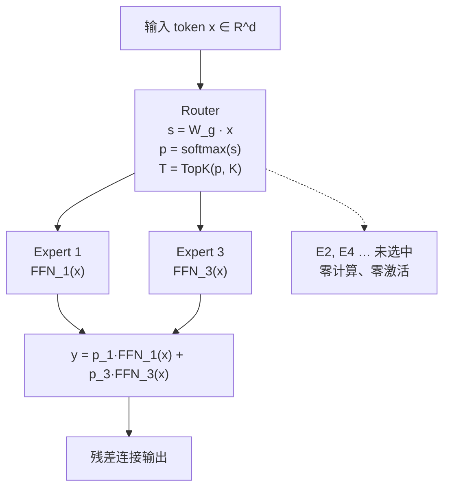

# 门控路由与Top-K稀疏激活

## 信号流向

## 核心结论

给定输入隐状态 $x \in \mathbb{R}^{d}$，一个含 $N$ 个专家的 MoE 层形式化为：

$$
y = \sum_{i=1}^{N} g_i(x) \cdot \mathrm{FFN}_i(x)
$$

其中 $g_i(x)$ 是门控网络输出的标量权重。标准 Top-K 稀疏门控为：

$$
g_i(x) = \begin{cases} \dfrac{\exp(s_i)}{\sum_{j \in \mathcal{T}} \exp(s_j)}, & i \in \mathcal{T} = \mathrm{TopK}(\{s_1,\dots,s_N\}, K) \\[4pt] 0, & \text{otherwise} \end{cases}
$$

$s_i = W_g x$ 为路由器 logits。**仅 $\mathcal{T}$ 中的 $K$ 个专家被实际计算**，其余 $N-K$ 个对当前 token 零激活——这是「条件计算」在算力上的全部含义。

## K 是关键超参

| 模型 | K 取值 | 演进动机 |
|---|---|---|
| Shazeer 2017 | Top-4 | 奠基的稀疏门控 |
| GShard | Top-2 | 大模型场景收敛更稳 |
| Switch Transformer | Top-1 | 简化路由、极致省算力 |
| DeepSeek-V3 | Top-8 路由 + 1 共享 | 细粒度专家下提高激活数保容量 |

K 越小单 token 算力越省、路由越难均衡；K 越大越接近稠密、组合自由度越高。这一取舍贯穿 [[路由坍缩与赢家通吃|负载均衡]] 与 [[稀疏激活与容量解耦|容量解耦]] 两端。

## 相关页面

- [[稀疏激活与容量解耦]]：K 与 N 分别决定什么——本页机制的直接收益。
- [[路由范式谱系]]：Token-Choice / Expert-Choice / 软分配 / 哈希四大范式的分野。
- [[路由坍缩与赢家通吃]]：可学习路由器在训练中失效的机理。
- [[Transformer编码器结构]]：MoE 层替换的就是其中的 FFN 子模块。

## 参考来源

- [[raw/papers/MoE.md]]
