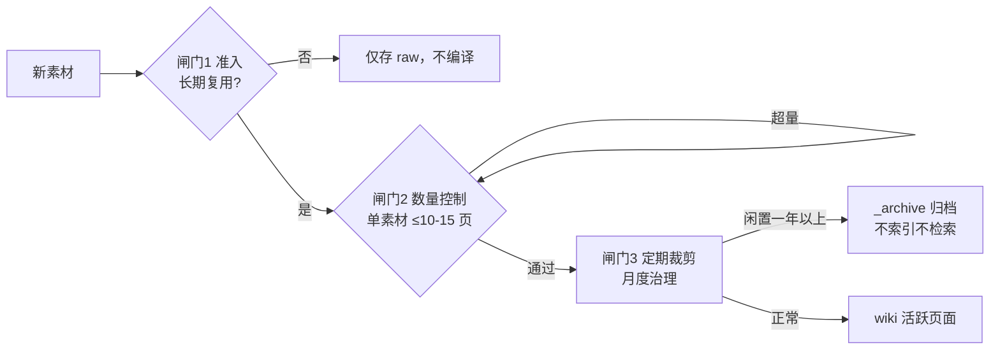

# 防膨胀三道闸门

## 闸门流程

## 核心结论
- 知识库失控的主要形态是**只增不剪、无限堆积**，最终沦为 [[结构化垃圾场]]。
- 三道闸门：**准入**（闸门 1）、**数量控制**（闸门 2）、**定期裁剪**（闸门 3），外加归档隔离兜底。

## 要点拆解
1. **闸门 1｜素材准入**：仅「长期学习、反复复用」的知识才执行 [[ingest工作流|Ingest]]；碎片化资讯只存 raw，不编译进 Wiki。
2. **闸门 2｜数量控制**：单份素材 Ingest 产出控制在 10-15 页，过度拆解则收紧规则。
3. **闸门 3｜定期裁剪**：月度治理将**一年以上无引用、无访问**的页面移入 `_archive` 归档。
4. **归档隔离**：`_archive` 页面不纳入 `index.md` 索引、不参与常规 Query 检索，原始素材仍保留在 raw，未来可重新编译。
5. 配套治理：每周 [[lint工作流|Lint]]、每月深度治理（标签标准化、合并拆分页面）、每季度规则迭代，形成 [[LLM-Wiki框架|完整闭环]]。

## 相关页面
- [[结构化垃圾场]]：本机制预防的主要风险
- [[ingest工作流]]：闸门 1/2 的落实流程
- [[lint工作流]]：闸门 3 的日常体检入口
- [[三层架构]]：_archive 在 wiki 层的定位

## 参考来源
- [[llm-wiki知识库方案]]