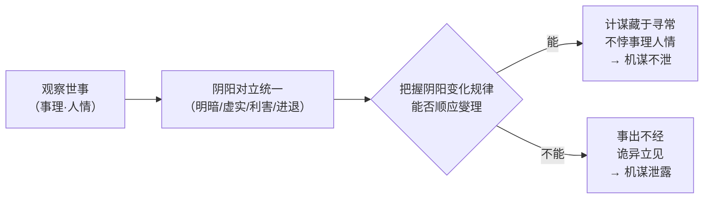

# 阴阳燮理

## 概念图

## 核心结论

- **阴阳燮理**是《三十六计》总说的哲学基础：阴阳属于中国传统哲学的基本范畴，认为事物普遍矛盾中存在一系列对立，可用以观察、解释、反映事物的矛盾运动。来源见 [[raw/books/三十六计/000-总说·三十六计.md]]「总说解析」。
- 兵家计谋能否成功，关键在于**是否正确把握对立统一、相反相成的阴阳变化规律**——如明与暗、虚与实、利与害、进与退的相互转化。

## 要点拆解

### 阴阳的对立统一落到谋略

- **阴在阳之内，不在阳之对**（第一计）：秘密谋略隐藏于公开行动之内，而非与公开行动相对立——这是[[阴阳燮理]]在战术层的直接体现，见 [[raw/books/三十六计/001-瞒天过海.md]]。
- **少阴、太阴、太阳**（第七计）：在稍微隐蔽的行动中隐藏大的秘密行动，大的隐蔽行动又常在非常公开的行动中进行，见 [[raw/books/三十六计/007-无中生有.md]]。
- 各计原文大量征引《周易》卦象（《损》《乾》《坤》《师》等）作为抽象依据，即阴阳数理与具体计谋的对应。

### 为什么要求谋略合于「事理人情」

- 总说按语指出：术法计谋原在**事理之中、人情之内**；倘若行事不合常规（事出不经），会立刻引起众人惊讶怀疑，机谋随之暴露。
- 这意味着高明的计谋不是反常识的花招，而是顺应事物本有规律的隐蔽操作——越「正常」越安全，越反常越暴露。
- 反面提醒：`夜半行窃、僻巷杀人`是愚俗之行，非讲求阴阳燮理的高明谋略（见第一计按语）。

### 与「数中有术／机不可设」的关系

- 总说以「数中有术、术中有数」统摄全书：策略须建立在客观形势的计算上，不是孤立技术清单。
- 「机在其中，机不可设，设则不中」：谋划应随阴阳时机而变，脱离实际、主观预设的谋略难以奏效。详见 [[raw/books/三十六计/000-总说·三十六计.md]]。

## 相关页面

- [[三十六计全库总览]]：阴阳燮理在全书六套体系中的位置。
- [[胜战计]]：首计「阴在阳之内」即为阴阳燮理的应用。
- [[走为上]]：「左次」退避同样是权衡阴阳动静（进与退）的结果。

## 参考来源

- [[raw/books/三十六计/000-总说·三十六计.md]]：总说原文、按语、注释、译文、总说解析。
- [[raw/books/三十六计/001-瞒天过海.md]]：第一计原文与按语（阴在阳之内）。
- [[raw/books/三十六计/007-无中生有.md]]：第七计原文与解析（少阴、太阴、太阳）。