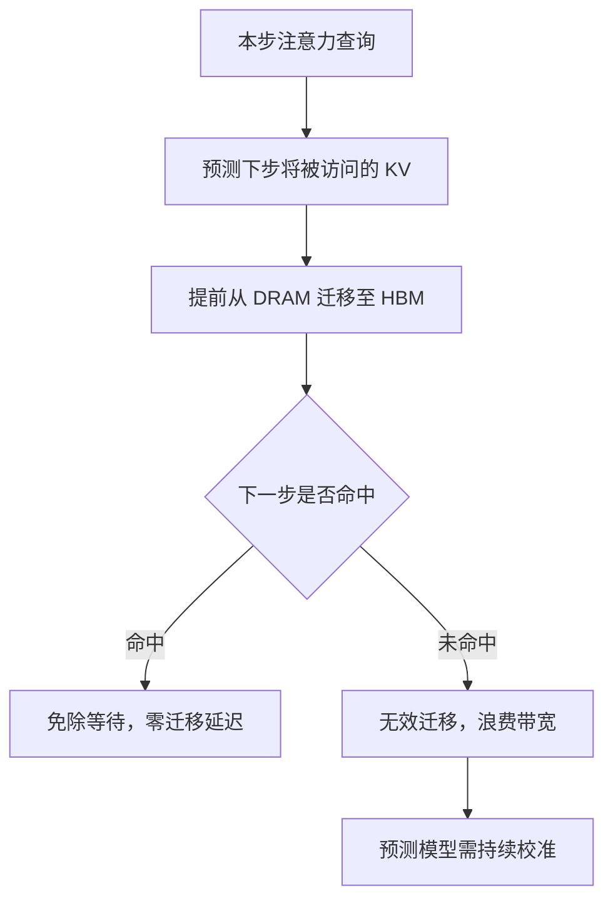

# 预取机制

## 核心结论

预取回答「何时提前搬」。依据是注意力访问模式的**可预测性**——时间局部性与 heavy-hitter 的跨步稳定性，使得「下一步可能访问哪些 KV」可以提前推断，从而在计算到达前完成迁移，命中时免除等待。

## 收益与代价

| 维度 | 效果 |
|------|------|
| 预测命中 | 免除换入等待，延迟表现接近全显存 |
| 预测失败 | 无效迁移，白白消耗带宽 |

预取的净收益取决于**预测准确率**与**单次无效迁移的带宽代价**之比——命中率不够高时，预取反而拖累吞吐。

## 适用条件

适用于注意力模式可学习、可预测的场景，如多轮对话（同一批 token 反复被回看）。单次性、无重复模式的场景预测收益有限。

## 相关页面

- [[换入换出与数据迁移]]：预取所提前的那个动作
- [[驱逐策略]]：预测与驱逐共享「哪些 token 重要」的判断依据
- [[InfiniGen]]：以预测预取为核心机制的代表项目
- [[代表项目对比]]：vLLM/FlexGen 无预取 vs InfiniGen/Mooncake 有预取

## 参考来源

- [[raw/papers/KV Cache分级存储.md]]