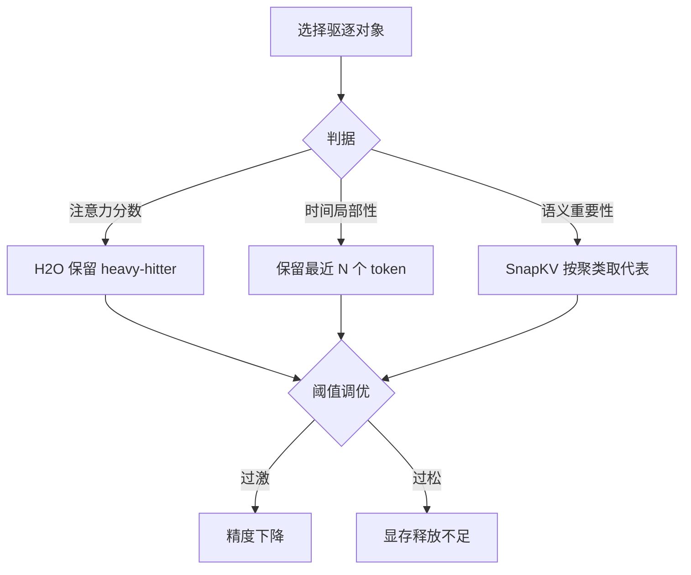

# 驱逐策略

## 核心结论

驱逐策略回答「谁该下沉到更慢的介质」。三类主流判据分别来自**注意力分数**、**时间局部性**、**语义重要性**，共同点是都假设并非全部 KV 等价。

## 三类判据

- **注意力分数驱动（H2O）**：累计注意力得分较高的 token 为 heavy-hitter，予以保留；其余下沉。是把「真正被关注」显式化的代表。
- **时间局部性**：最近 N 个 token 保留于显存，更早的 token 下沉。最简单，无需训练额外模型。
- **语义重要性（SnapKV）**：依据聚类或语义信息选取代表性 token 保留，避免按位置切分误删关键信息。

## 关键权衡

| 阈值设置 | 后果 |
|----------|------|
| 驱逐过激 | 精度下降（困惑度上升） |
| 驱逐不足 | 无法有效释放显存 |

调优手段：离线标注集 + 线上 A/B 测试确定阈值，不由开发者手工逐 token 决策。

## 常见问题

- **延迟抖动**：驱逐与换入时机不稳定导致 TPOT 毛刺。
- **预取预测失效**：预测模型失准导致无效迁移浪费带宽，需持续校准。

## 相关页面

- [[KV Cache分级存储]]：驱逐所属的总体机制
- [[三级存储金字塔]]：下沉目标层级
- [[预取机制]]：与驱逐互补的提前迁入
- [[压缩机制与体积缩减]]：稀疏化与驱逐思路同源
- [[代表项目对比]]：各项目的驱逐策略差异

## 参考来源

- [[raw/papers/KV Cache分级存储.md]]