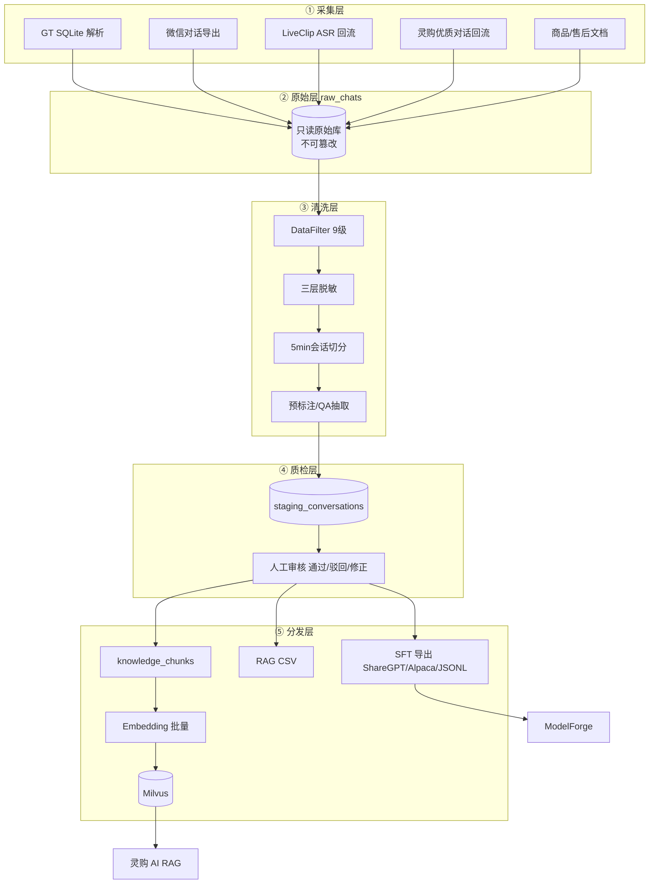

# DataBus

## 分层架构



## 核心结论
- 全矩阵的**数据底座**：灵购 AI 的 RAG 知识、ModelForge 的 SFT 语料都从这里来；灵购 AI **不自己造知识**。
- 五层架构：**采集 → raw_chats 只读 → 9 级清洗脱敏 → staging 人工质检 → SFT/RAG 分流导出**，核心是「洗干净、可追溯、双出口」。
- 不是一次性 ETL，而是**数据总线**：各 Agent 产出（ASR、高光标签、优质对话、素材元数据）回流中台，支撑模型与 RAG 持续迭代。

## 要点拆解

### 数据源与清洗流水线
```
采集 → raw_chats（只读，不可篡改）
     → DataFilter 9级过滤（去噪声/闲聊/垃圾咨询）
     → 正则脱敏（手机/身份证/价格/内部编码）
     → 5分钟会话窗口切分 + QA抽取 + 质量打分
     → staging_conversations 人工审核
     → 通过后导出 / 向量化
```
- **GT SQLite**：MSG0-5.db + MicroMsg.db；账号 ID↔昵称映射、群聊发言人、时间区间，`(会话,时间,内容)` 联合主键去重。
- **9 级过滤**（举例）：系统通知/纯媒体/无效短句/敏感未脱敏 → 丢弃或拦截；闲聊/垃圾咨询 → 丢弃；一般业务 → 保留；高价值购机/售后 Care → 优先保留+加速审核。
- **5 分钟会话窗口**：太短上下文断裂学不到销售链路，太长超 token 上限、噪声多。

### 三层脱敏（为什么重要）
| 层级 | 作用 |
|------|------|
| 清洗入库时 | 正则脱敏手机、身份证、银行卡、API 密钥 |
| 持久化存储 | 价格、渠道供货价强制脱敏 |
| 对外导出前 | 再次校验，防微调模型泄露真实定价 |

### SFT / RAG 分流
- **同源、异用**：SFT 多轮对话（话术、咨询风格）→ ModelForge 微调；结构化知识（参数、政策、FAQ）→ RAG 向量库。
- 策略一致：**微调管「怎么说」，RAG 管「知道什么」**——活动更新只更知识库，不必重训模型。

### knowledge_chunks 数据模型（口述用）
`chunk_id` / `content` / `product_series`（Mavic/Mini/Osmo）/ `scene_type`（售前/售后/Care/活动）/ `accessory_model` / `source_type` / `confidence` / `vector`。

### 活动/新品更新全流程
```
运营在商城后台更新文档 → 增量 ETL → 新 chunk embedding → Milvus upsert → 灵购无需发版、无需重训 ModelForge
```

## 相关页面
- [[商城AI业务矩阵]]：DataBus 在矩阵中的底座定位
- [[灵购AI]]：DataBus 供数 → 灵购用数 → 优质对话回流
- [[ModelForge-AI]]：DataBus 供 SFT 语料 → ModelForge 微调
- [[RAG检索优化五层]]：灵购侧在线检索在已入库 chunk 上做 HNSW/filter/rerank

## 参考来源
- [[贸易AI业务]]