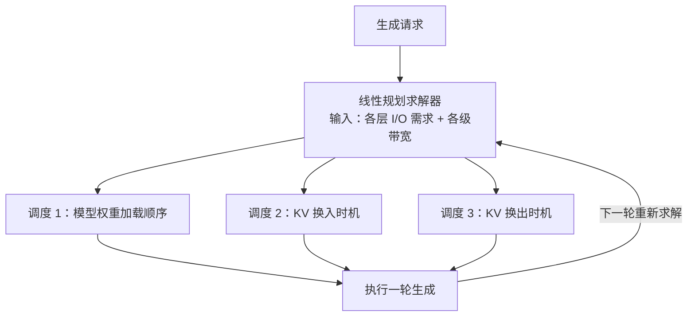

# FlexGen

## 核心结论

FlexGen（2023）的定位是**单 GPU 跑大模型**：采用 GPU/CPU/SSD **三级存储**，并用**线性规划**求解最优的换入换出调度策略。面向单请求长上下文场景，以**吞吐量**为优化目标，不做预取。

## 调度机制

线性规划把「哪一层、什么时候、搬多少」变成一个可数学求解的资源分配问题，从而在给定带宽下最大化吞吐——这是它与页级换出类方案的分野。

## 方案定位

| 维度 | FlexGen |
|------|---------|
| 层级 | 3 级（GPU + CPU + SSD） |
| 驱逐策略 | 线性规划调度 |
| 预取 | 无 |
| 适用场景 | 单请求长上下文 |

对比 [[vLLM]]（两级页级换出）、[[InfiniGen]]（预测预取）、[[Mooncake]]（KV 中心分离）。

## 价值与边界

- **解决**：单 GPU 容量下承载长上下文，以规划式调度压榨有限带宽。
- **边界**：优化目标锁定吞吐量、面向单请求；高并发服务场景需另看 [[Mooncake]] 这类分离式架构。

## 相关页面

- [[三级存储金字塔]]：FlexGen 三级存储的参数对照
- [[换入换出与数据迁移]]：线性规划调度所调度的对象
- [[KV Cache分级存储]]：所属的总体方案
- [[代表项目对比]]：四个代表项目的横向对比

## 参考来源

- [[raw/papers/KV Cache分级存储.md]]
- Y. Sheng et al. ["FlexGen: High-Throughput Generative Inference of Large Language Models with a Single GPU."](https://arxiv.org/abs/2303.06865) *ICML*, 2023.