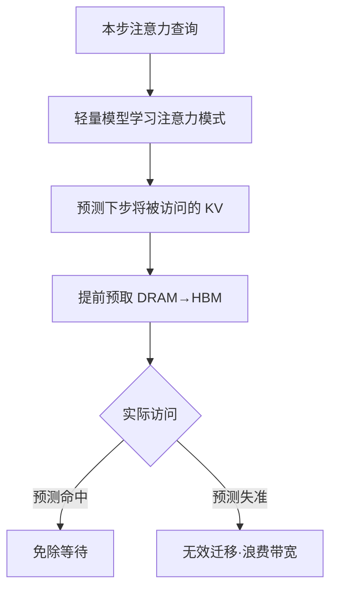

# InfiniGen

## 核心结论

InfiniGen（OSDI 2024）的差异化在**预测预取**：通过学习注意力模式预测未来的 KV 访问行为，在计算到达之前把 KV 从 DRAM 预取到 HBM，从而减少换入等待。驱逐侧为注意力驱动。

## 适用前提

预测预取的有效性取决于**注意力模式是否可学习**。多轮对话中同一批 token 反复被回看，模式稳定、预测收益高；单次性、无重复模式的场景则收益有限。

## 方案定位

| 维度 | InfiniGen |
|------|-----------|
| 层级 | 2 级 |
| 驱逐策略 | 注意力驱动 |
| 预取 | **有**（核心机制） |
| 适用场景 | 多轮对话 |

对比 [[vLLM]]（两级无预取）、[[FlexGen]]（三级规划式无预取）、[[Mooncake]]（多级有预取）。

## 价值与边界

- **解决**：换入等待延迟——把延迟从「访问时」挪到「访问前」。
- **边界**：预测失准即无效迁移，净收益取决于命中率；命中率不足时反噬吞吐。

## 相关页面

- [[预取机制]]：本页的核心机制在概念层的展开
- [[驱逐策略]]：注意力驱动判据的来源
- [[换入换出与数据迁移]]：预取所提前的动作
- [[代表项目对比]]：四个代表项目的横向对比

## 参考来源

- [[raw/papers/KV Cache分级存储.md]]
- W. Lee et al. ["InfiniGen: Efficient Generative Inference of Large Language Models with Dynamic KV Cache Management."](https://arxiv.org/abs/2406.19707) *OSDI*, 2024.