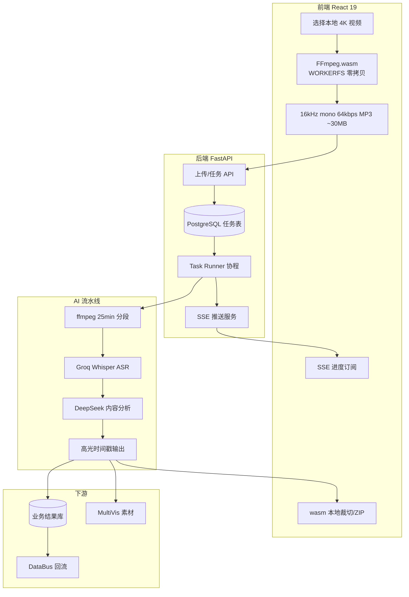

# LiveClip-AI

## 三层架构



## 核心结论
- 解决商城**长时带货直播人工剪片效率低**：前端 wasm 把 4K 原片（~2.5GB）压成 16kHz 64kbps MP3（~30MB），**上传流量降 ~99%、等待分钟级→秒级**。
- 后端 **PostgreSQL 自研任务队列**（pending→running→done，`FOR UPDATE SKIP LOCKED` 抢占、崩溃自愈）调度 ASR + 大模型识别高光，批量产出短视频。
- 超长直播 **25min ffmpeg 无损分段 + 时间 offset 拼回时间轴**，LLM 6000 token 分批 + 双向重叠去重；ASR 与高光标签**回流 DataBus**。

## 要点拆解

### 为什么用 FFmpeg.wasm
- WORKERFS **零拷贝**挂载文件系统，不整文件读入 JS 堆，避免 2.5GB OOM。
- 高光识别**以语音内容为主**，只抽音频给后端；视频裁切**回前端 wasm 本地做**，后端不算力扛重编码。

### PG 任务队列状态机
```
pending ──抢占──→ running ──成功──→ done
   ↑                │
   │                └──失败──→ failed（可人工重置 pending）
   │
   └── 进程崩溃：running 超时/重启时 reset → pending
```
- 为什么不 Redis/RabbitMQ：与业务库一体、进度同表、SQL 重置恢复、运营吞吐够用，运维成本低。
- 为什么串行：ASR/LLM 有 QPS 上限，运营批量分钟级可接受，稳定性优先。

### 超长直播处理
**阶段 A 物理分段（ASR）：** 6 小时 → ffmpeg 无损切每 25min → 段 i ASR + `offset_i = i×25min` → 合并 `global_timestamp = local_ts + offset_i`。
**阶段 B 语义分段（LLM）：** 全文按 6000 token 切批 → 每批抽「讲解/福利/爆款」→ 相邻批 overlap 窗口，**重合度>30% 保留高分段**防重复切片。

### SSE 进度模型
progress 0-10 上传入库 / 10-40 分段+ASR / 40-80 LLM 分析 / 80-100 写库可导出；进度存 PG，**断线重连续传**不从头跑。

### 三套 Prompt 场景
直播带货（短、强促销）、无人机实景测评（长、画面描述）、新品宣讲（参数完整、逻辑线）；输出爆款潜力分、种草文案、标题与剪辑脚本。

## 相关页面
- [[商城AI业务矩阵]]：LiveClip 在矩阵中的内容生产定位
- [[DataBus]]：ASR/高光标签回流
- [[MultiVis-AI]]：短视频素材供 MultiVis 二次加工
- [[商城AI业务矩阵]] 内 [[四大项目架构对比]]：与其它项目的架构对比

## 参考来源
- [[贸易AI业务]]