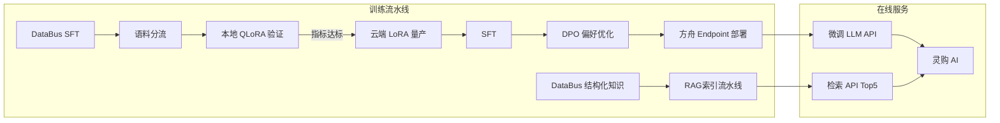

# ModelForge-AI

## 双流水线架构



## 核心结论
- **模型与检索能力工厂**：灵购 AI 的专属 LLM 与 Rerank 检索链路都从这里出，统一供给灵购/LiveClip/MultiVis。
- 策略一句话：**微调管「怎么说」（话术风格），RAG 管「知道什么」（实时业务知识）**——新品/活动只更向量库，不必重训模型。
- 两阶段：**本地 QLoRA 快速验数据 → 云端量产防过拟合**（rank 64→32，lr 2e-4→1e-5）；盲评 2.1→4.3。

## 要点拆解

### 微调全链路
```
① DataBus 导出 ShareGPT/JSONL
② 本地 QLoRA（Qwen2.5-3B, rank=64, lr=2e-4, 4090 ~40min/轮）
   → 验：loss 收敛、样例生成、无明显幻觉/泄露
③ 云端豆包1.5 LoRA（rank=32, lr=1e-5，按模型尺寸缩放）
④ SFT：学话术风格与多轮结构
⑤ DPO：同一 prompt 多条回复 → 销售标 preferred/rejected
⑥ 盲评（2.1→4.3）→ 部署专属 Endpoint
```

### 本地验证 vs 云端量产
| 阶段 | 环境 | 配置 | 目的 |
|------|------|------|------|
| 本地验证 | 单卡 RTX 4090 | Qwen2.5-3B + QLoRA rank=64, lr=2e-4 | 快速验语料与超参，40min/轮 |
| 云端量产 | 火山方舟 | 豆包 1.5 LoRA rank=32, lr=1e-5 | 生产级部署，防过拟合 |

### 为什么微调 + RAG 都要
| | 微调 | RAG |
|--|------|-----|
| 擅长 | 语气、转化引导、多轮风格 | 参数、价格政策、Care 条款 |
| 更新成本 | 高（重新训练） | 低（重新入库） |

### 三段式混合检索
```
用户 query → Embedding 向量编码 → 向量库粗召回 Top20 → Cross-Encoder 联合编码精排 → Top5 进 LLM
```
- 效果：命中率 72%→89%（商城标注 query 集）。
- 与灵购五层关系：ModelForge 提供**精排能力与检索服务**；灵购侧还有 HNSW、Int8、元数据 filter 等**在线 Milvus 优化**。

### SFT / DPO
- **SFT**：模仿商城销售对话，解决逻辑不通、话术不像。
- **DPO**：同一问题多条回复，资深销售标优劣对，优化专业度与转化引导；小样本下比 RLHF 更稳定（无需单独奖励模型 + PPO），数百条标注即可。

## 相关页面
- [[商城AI业务矩阵]]：模型底座在矩阵中的定位
- [[灵购AI]]：ModelForge 供 LLM + Rerank，灵购做 RTC 场景集成
- [[DataBus]]：ModelForge 语料来源
- [[QLoRA与LoRA微调]]：SFT/DPO/LoRA 技术详解
- [[RAG检索优化五层]]：与灵购在线五层衔接

## 参考来源
- [[贸易AI业务]]