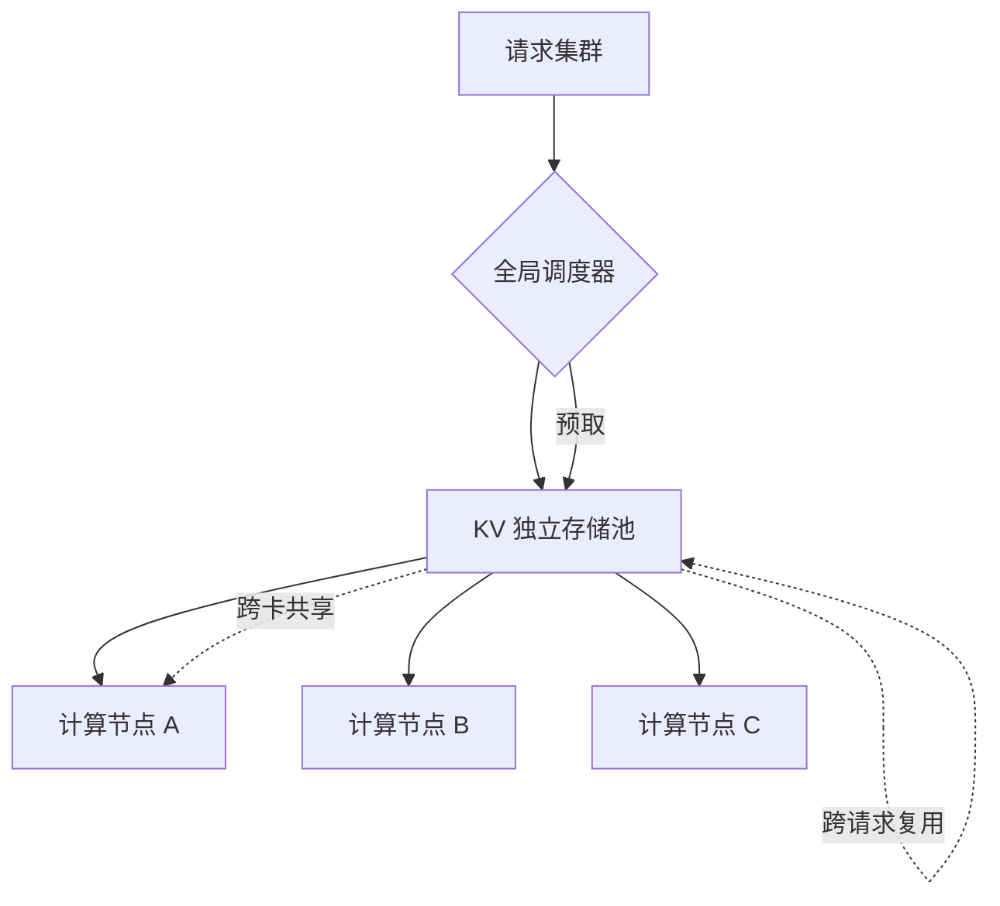

# Mooncake

## 核心结论

Mooncake 的架构视角不同于前三者：它不做单机内的层级调度，而是**以 KV Cache 为中心做分离式架构**——把 KV 抽成独立存储池，支撑**跨请求、跨卡共享**，配合全局调度与预取，面向高并发与长上下文服务。

## 架构取向差异

| 项目 | 作用域 | 核心抽象 |
|------|--------|----------|
| [[vLLM]] | 单机 | 页 |
| [[FlexGen]] | 单机 | 线性规划调度 |
| [[InfiniGen]] | 单机 | 注意力预测 |
| **Mooncake** | **集群** | **KV 独立存储池** |

前三者都在优化「一块卡上怎么放」，Mooncake 优化的是「多卡多请求之间怎么共享 KV」——因此层级标为多级、调度为全局。

## 价值与边界

- **解决**：高并发下 KV 的重复存储与跨请求复用难题，把 KV 从「单请求私有」变成「集群共享资源」。
- **前提**：需要集群级基础设施，部署复杂度高于单机方案。

## 相关页面

- [[KV Cache分级存储]]：Mooncake 所属的总体方案
- [[显存墙]]：高并发叠加放大后的容量瓶颈
- [[三级存储金字塔]]：存储层级的通用参数
- [[代表项目对比]]：四个代表项目的横向对比

## 参考来源

- [[raw/papers/KV Cache分级存储.md]]
- R. Qin et al. ["Mooncake: A KVCache-centric Disaggregated Architecture for LLM Serving."](https://arxiv.org/abs/2407.00079) *ACM Trans. Storage*, 2025.