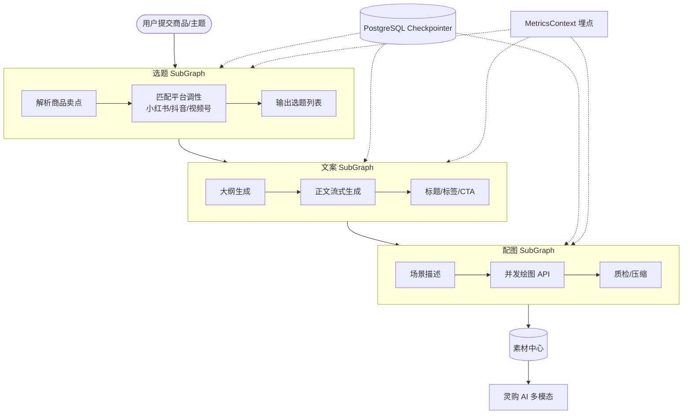

# MultiVis-AI

## LangGraph 总架构

## 核心结论
- 面向小红书/抖音/视频号等**自媒体种草**场景，批量化生成图文视频内容；素材进**素材中心**，供灵购 AI 多模态答疑。
- 关键设计：**LangGraph 子图拆分 + PostgreSQL Checkpointer 节点级持久化**——长链路任一节点失败从**最近成功节点重试**，而非整单重来，Token 成本低、保留已生成内容。
- 性能口径：配图并发 `asyncio.gather` + 指数退避（耗时 ↓70%）；多模型路由 + structured_output（成本 ↓40%）；文案首包 TTFT ↓60%（**自媒体生成侧，非灵购语音 TTFT**）。

## 要点拆解

### 为什么用 LangGraph 而非简单 Chain
| 能力 | 价值 |
|------|------|
| SubGraph | 选题/文案/配图独立编排 |
| Checkpointer | 状态持久化，断点续跑 |
| astream_events | 与前端 SSE 逐 Token 联动 |

### Checkpointer 故障自愈
- 每 SubGraph 节点结束把 state 持久化到 PostgreSQL（`thread_id + checkpoint_id`）。
- 失败时从最近成功节点重试，而非从选题重做；与 LiveClip PG 任务队列对比：后者是**整任务** pending/running/done，前者是 **Graph 节点级** state。

### 多模型路由降本
- 短标题/标签 → Flash 轻量模型；标准种草 → 中端；长图文测评 → 旗舰。
- `with_structured_output` + Pydantic 约束 JSON，减少解析失败重试；MetricsContext 按火山计价核算单篇成本。

### 可观测与高可用
Mock 开关（llm/绘图/存储）本地调试效率 ↑3x；LangSmith trace；structlog + request_id 故障定位小时→分钟；SlowAPI 限流 + K8s 健康检查 + 优雅关闭；绘图/LLM 连续失败熔断降级文案-only。

### 闭环
LiveClip 短视频 → MultiVis 二次加工（可选）；MultiVis 图文视频 → 素材中心 → 灵购 RAG/素材服务按 SKU+场景检索 → 语音答复图文音视频一体。

## 相关页面
- [[商城AI业务矩阵]]：MultiVis 在矩阵中的内容生产定位
- [[灵购AI]]：素材中心 → 灵购多模态回复
- [[LiveClip-AI]]：短视频素材来源
- [[LangGraph与Checkpointer工作流]]：核心技术原理

## 参考来源
- [[贸易AI业务]]