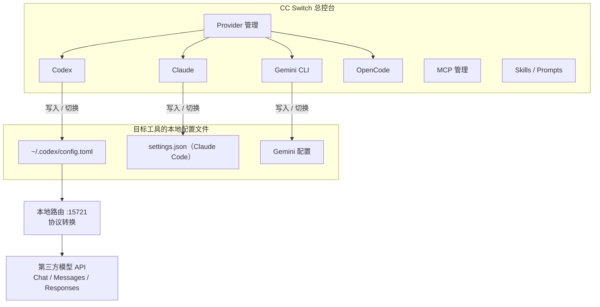

# cc-switch

## 是什么

CC Switch 是跨平台开源桌面工具（仓库 [farion1231/cc-switch](https://github.com/farion1231/cc-switch)，官方站 [ccswitch.io](https://ccswitch.io/)），用于以图形界面统一管理 Claude Code、Codex、Gemini CLI、OpenCode 等 AI 编程工具的供应商配置、MCP 服务器、Skills 扩展和系统提示词，可以把它理解成「AI 编程工具的总控台」。另有命令行版 cc-switch-cli（[SaladDay/cc-switch-cli](https://github.com/SaladDay/cc-switch-cli)），适合服务器 / SSH / 自动化。

## 核心能力

- **一键切换 API 配置**：在多个 API 提供商之间快速切换，无需手动改 `settings.json` / `config.toml` / `.env`；
- **跨应用管理**：同一套 provider 可作用到 Claude Code、Codex、Gemini CLI 等多个工具（注意：同一个 provider 不一定同时适配所有工具）；
- **本地路由（协议转换）**：v3.16.0 起支持 Local Routing，把 Codex 的 [[#Responses API]] 请求透明转发并转换为第三方 Chat Completions / Anthropic Messages 协议（详见 [[CC Switch本地路由]]）；
- **MCP 管理 / Prompts 管理 / Skills 管理**：集中管理 MCP 服务器、预设系统提示词（CODE 系列 `CLAUDE.md`/`AGENTS.md`/`GEMINI.md`）与 skills；
- **模型映射**：4 层模型配置粒度（主模型 + Haiku/Sonnet/Opus 或自定义），为 Codex 生成 `/model` 下拉列表（详见 [[Codex模型映射与模型目录]]）；
- **官方登录保留**：切换第三方 provider 时可选保留 Codex 官方登录（详见 [[Codex官方登录保留机制]]）。

## 一图看结构

## 版本与安装

- **桌面版**：macOS `brew install --cask cc-switch`；Windows 下载 `.msi`；Linux 选 `.deb` / `.rpm` / AppImage。仅从官方 Releases / 官网获取安装包。
- **命令行版 cc-switch-cli**：`brew install cc-switch-cli` 或官方一键脚本；注意桌面版包名 `--cask cc-switch` 与 CLI 版 `cc-switch-cli` 极易装混。

## 关键使用纪律

- **CC Switch 管配置，不保证接口兼容**：真正决定能否跑通的是服务商是否支持对应 CLI 所需的协议、模型与流式能力；
- **先手动跑通，再交给 CC Switch**：先手动验证 Base URL / API Key / 模型名没问题，再录入 CC Switch，避免把一个未知问题包进另一个未知问题；
- **切换后务必重启目标 CLI**：Codex 启动时才读 `config.toml`、加载 `/model` 模型目录；
- **排查"切换没生效"先查环境变量**：shell 残留的 `OPENAI_BASE_URL` / `OPENAI_API_KEY` / `ANTHROPIC_BASE_URL` 等优先级高于配置文件（见 [[Codex接第三方模型排障清单]]）。

## 相关页面

- [[CC Switch本地路由]]：协议转换的核心机制
- [[Codex自定义模型Provider]]：不依赖 CC Switch 的原生接入方式
- [[Codex模型映射与模型目录]]：/model 列表来源
- [[Codex官方登录保留机制]]：退路保障
- [[Codex接入第三方模型总览]]：三条路线的全景
- [[MCP网关]]：另一类 AI 网关形态，注意 CC Switch 的 MCP 管理 ≠ 协议网关

## 参考来源

- [[raw/articles/cc-switch安装与使用教程.md]]
- [[raw/articles/cc-switch-codex-第三方模型接入.md]]