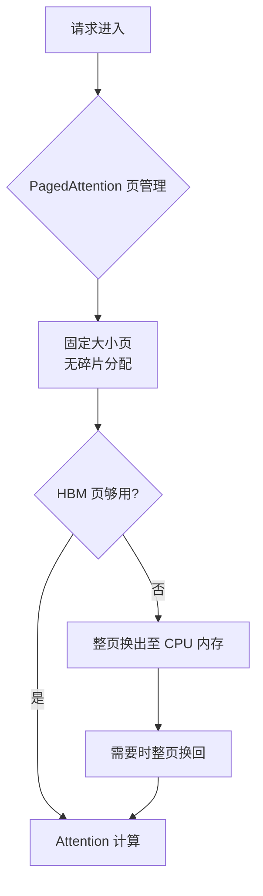

# vLLM

## 核心结论

vLLM（UC Berkeley，2023）的核心贡献是 **PagedAttention**：把 KV 按页管理，取代连续内存分配，从而消除显存碎片。其存储层级为**两级**（GPU HBM + CPU DRAM），显存不足时**整页换出**到 CPU 内存，实现简洁，适用于中等长度序列。

## 关键设计

- **页式分配**：固定页大小、按需分配，避免连续块要求导致的碎片。
- **整页换出**：粒度对齐页，不做 token 级细粒度迁移，实现简单。
- **无预取**：不做访问预测，换入在被访问时才发生。
- **写时复制（Copy-on-Write）**：同 Prompt 多采样共享前缀页，beam search 场景显存节省可达 **55%**。
- **自动前缀缓存**：对前缀序列做哈希（`hash(前缀 + 块索引)`）实现物理块全局复用，相同系统提示词不重复计算。

**实测吞吐**：凭 PagedAttention 的内存效率，吞吐量相比原生 HuggingFace 实现提升 **14–24 倍**，相比 TGI 提升 **2.2–3.5 倍**，是目前工业界部署的主流选择。

## 方案定位

| 维度 | vLLM |
|------|------|
| 层级 | 2 级（HBM + DRAM） |
| 驱逐策略 | 页级换出 |
| 预取 | 无 |
| 适用场景 | 中等长度序列 |

对比 [[FlexGen]]（三级 + 线性规划）、[[InfiniGen]]（预测预取）、[[Mooncake]]（KV 中心分离）。

## 价值与边界

- **解决**：显存碎片、连续块分配失败——提升的是**利用率**。
- **未解决**：KV 总量超出 HBM 容量时，只能换出到单机 DRAM，无法突破单机上限。

## 相关页面

- [[PagedAttention分页内存]]：vLLM 核心技术的机制拆解
- [[前缀缓存与PagedAttention]]：PagedAttention 的能力边界辨析
- [[KV Cache分级存储]]：vLLM 换出机制所属的总体方案
- [[驱逐策略]]：vLLM 的页级换出属于最简粒度
- [[主流推理框架KV技术对比]]：vLLM 与其余四家框架的横向对比
- [[代表项目对比]]：四个代表项目的横向对比

## 参考来源

- [[raw/papers/KV Cache.md]]
- [[raw/papers/KV Cache分级存储.md]]
- W. Kwon et al. ["Efficient Memory Management for Large Language Model Serving with PagedAttention."](https://arxiv.org/abs/2309.06180) *SOSP*, 2023.