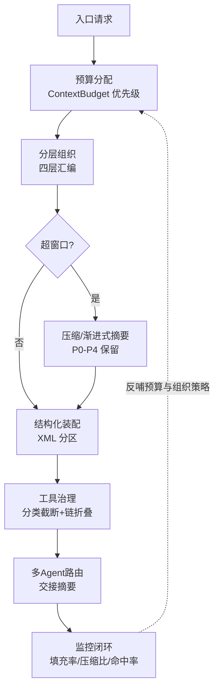

# AI-Agent上下文管理总览

## 核心结论

上下文管理决定 Agent 能力天花板：指令遵循、推理连贯、工具准确、信息保真四维皆取决于"模型看到什么"。它的第一性原理是 Anthropic 的断言——**在有限注意力预算内，找到能最大化期望结果的最高信号 token 子集**（上下文工程，是提示工程的演进）。整条链路由七环闭环构成：窗口预算 → 分层组织 → 有损压缩 → 结构化装配 → 工具结果治理 → 多 Agent 路由 → 监控反哺，环节缺一即诱发"上下文腐烂"（context rot）。

## 流程总览

## 七环分解

| 环节 | 核心机制 | 对应页面 |
|---|---|---|
| ① 预算分配 | 系统指令>当前消息>工具结果>历史；工具结果超 40% 先压缩 | [[上下文窗口与Token预算]] |
| ② 分层组织 | 固定/半固定/动态注入/交互四层，记忆置于历史前 | [[上下文分层组织]] |
| ③ 有损压缩 | 滑动窗口+渐进式摘要、P0-P4 保留金字塔 | [[上下文压缩与摘要策略]] |
| ④ 结构化装配 | XML 分区作锚点，按标签块截断 | [[结构化上下文]] |
| ⑤ 工具治理 | 分类截断、链折叠、context editing | [[工具结果上下文治理]] |
| ⑥ 多 Agent 路由 | 独立空间+交接摘要+Memory ID 引用 | [[多Agent上下文路由]] |
| ⑦ 监控反哺 | 填充率/压缩比/命中率/指令遵循率 | [[上下文监控指标]] |

## 三个关键量化锚点

- **Lost in the Middle（U 形曲线）**：模型对上下文首尾利用最优、中段显著退化，且检索更长文档不必然换回精度。
- **context editing 实测**：100 轮网页搜索任务 token 消耗降 84%，本会因耗尽而失败的工作流得以完成；memory tool+context editing 组合整体提升 39%。
- **Agent 单轮消耗**：保守 15k–30k token，一次网页抓取可达 50k——不管理必然超窗。

## 相关页面

- [[上下文爆炸治理方案对比]]：24 种治理方案矩阵，与七环互为补充（更侧重找回与可逆性）
- [[多Agent上下文管理总览]]：多 Agent 上下文路由/一致性/异常三大问题全景
- [[上下文污染]]：多 Agent 上下文相互污染的成因与分类
- [[LLM-Agent安全防护总览]]：上下文注入防护（安全维度与质量维度双线）
- [[Agent循环总览]]：上下文管理的大宿主——Agent Loop 的四支柱之一

## 参考来源

- [[raw/papers/AI-Agent上下文管理综合研究.md]]（本文编译主源）
- [[raw/articles/juejin-AI-Agent上下文管理综合研究.md]]（掘金原作者素材）