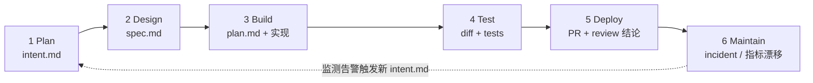

# AI-native-SDLC

## 架构/流程总览

## 核心结论
- AI-native SDLC 是一套**把控制目标保留、把执行换成 AI**的重构流程：不再是线性阶段流水线，而是**循环 + AI 嵌入每个点**，配**承交付物自动触发下一阶段** [[committed-artifact]]。
- 核心前提：**代码不再是最慢环节**；真正的瓶颈移动到 build 两侧仍按人类步速运转的 plan / review+test / deploy，同时旧控制失配（逐行评审跟不上 agent 产出）、治理成本上升（例外仍走周会月会）[[The AI-Native SDLC playbook]]。
- 每个操作单元是 **play**（打法），按六阶段（Plan/Design/Build/Test/Deploy/Maintain）分组，自带前置依赖、失败治理与效果度量；采用顺序**不等于**阶段顺序，用依赖图决定（无入箭头的"clay play"可最先落地）[[The AI-Native SDLC playbook]]。
- 治理总原则：**人类对每个需要判断的决策负责**；写代码的 agent 永远无权批准自己的产出（职责分离），approval 通过 branch protection + hooks 强制。

## 要点拆解
- **两个瓶颈迁移**：build 从数周压缩到小时级后，瓶颈移到 build 左侧（计划）与右侧（评审/测试/发布），这两侧必须同步提速否则安全与安全评审排队 [[The AI-Native SDLC playbook]]。
- **承交付物贯穿**：每阶段结束向版本库提交一个 artifact（intent.md / spec.md / plan.md / 实现+测试 / PR+评审结论 / incident 记录），下一阶段从读它开始；commit 链即**审计轨迹**（谁要什么、agent 产出什么、谁批准了）。
- **控制金字塔**：[[Skills技能]]（建议性，代码编写时提高遵循概率）→ [[Hooks护栏与审批门]]（确定性，`allow / ask / block`）→ CI evals（[[持续评估]]，配置变更回归闸门）→ 人类 gate（可 approve 的唯一实体）。
- **人类注意力集中在 gate**：人工不再逐行看 diff，而是审 agent 标记的 concern（spec 中被标记的矛盾策略、pr review 的 Important findings、3σ 提案、release 授权）[[The AI-Native SDLC playbook]]。
- **从手动到闭环**：初跑各阶段由人逐条 prompt → 成熟后由"接受的 artifact 触发下个 gate"的自动化：accepted intent.md 触发 design→approved spec 触发 plan→merge PR 触发 pipeline→生产指标破band 写下一个 intent.md。
- 同义叫法：agentic SDLC、AI SDLC、agentic software development，指同一件事。

## 相关页面
- [[committed-artifact]]：贯穿六阶段的产物链与审计机制，本总览的骨架
- [[AI代码评审]] / [[Hooks护栏与审批门]]：Deploy 侧的评审与门禁
- [[监控闭环]]：Maintain 侧让循环自主运转的触发层
- [[LLM-Wiki框架]]：同为"AI 承担劳动、人类负责验收"的编译型流程范式
- [[AI-native-SDLC·素材摘要]]：本页面素材摘要

## 参考来源
- [[The AI-Native SDLC playbook]]