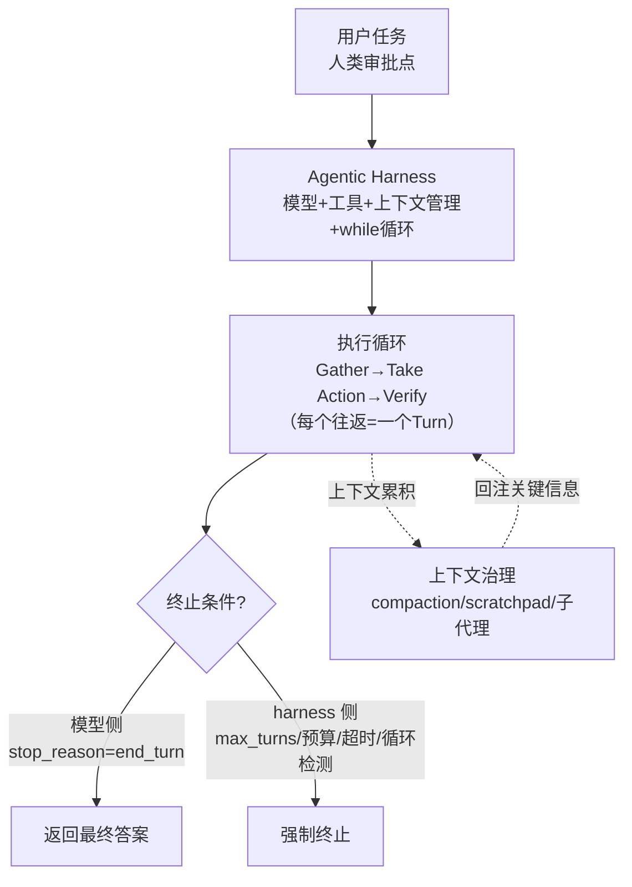

# Agent循环总览

## 核心结论

Agent 的智能来自模型，能力来自"循环 + 工具 + 上下文治理"。Anthropic 官方定义：「LLMs autonomously using tools in a loop」。Agent 循环全景四个支柱相互咬合——**三阶段模型**给出循环怎么转、**Turn 机制**给出每轮的技术单元、**终止双保险**保证可控、**上下文治理**保证转得久不失控。

## 全景图

## 四支柱

| 支柱 | 机制 | 对应页面 |
|---|---|---|
| ① 三阶段模型 | Gather Context → Take Action → Verify Results，相互融合非线性 | [[Agent循环]] |
| ② Turn 机制 | 一次往返=一个 Turn，五类 Message，循环至无工具调用 | [[Turn与消息生命周期]] |
| ③ 终止双保险 | 模型 stop_reason + harness 硬护栏，hooks 控制点 | [[Agent循环终止与护栏]] |
| ④ 上下文治理 | compaction / scratchpad / 子代理摘要，context rot 防线 | [[上下文压缩与摘要策略]]、[[多Agent上下文路由]] |

## 相关页面

- [[Agent循环]]：核心概念页（本质定义 + 三阶段模型）
- [[Agentic Harness]]：承载循环的运行时外壳
- [[AI-Agent上下文管理总览]]：上下文治理七环，是长循环的"工作记忆"
- [[Function Calling三阶段模型]]：单轮工具调用的内部展开
- [[Agent异常处理与循环检测]]：循环缺终止条件的故障形态（IAL）
- [[Agent反馈闭环]]：Verify 阶段在 AI-native SDLC 落地为自验回路

## 参考来源

- [[raw/papers/Agent Loop.md]]（编译主源）