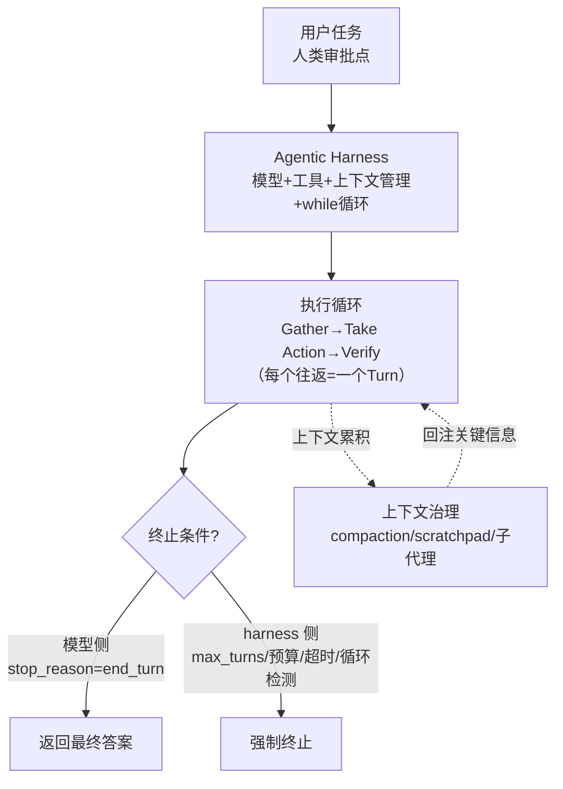

# Agent循环总览

## 核心结论

Agent 的智能来自模型，能力来自"循环 + 工具 + 上下文治理"。Anthropic 官方定义：「LLMs autonomously using tools in a loop」。Agent 循环全景四个支柱相互咬合——**三阶段模型**给出循环怎么转、**Turn 机制**给出每轮的技术单元、**终止双保险**保证可控、**上下文治理**保证转得久不失控。

## 全景图

```mermaid
flowchart TD
    IN["用户任务<br/>人类审批点"] --> H["Agentic Harness<br/>模型+工具+上下文管理+while循环"]
    H --> B["执行循环<br/>Gather→Take Action→Verify<br/>（每个往返=一个Turn）"]
    B --> F{"终止条件?"}
    F -- "模型侧<br/>stop_reason=end_turn" --> OK["返回最终答案"]
    F -- "harness 侧<br/>max_turns/预算/超时/循环检测" --> STOP["强制终止"]
    B -. "上下文累积" .-> C["上下文治理<br/>compaction/scratchpad/子代理"]
    C -. "回注关键信息" .-> B
```

## 四支柱

| 支柱 | 机制 | 对应页面 |
|---|---|---|
| ① 三阶段模型 | Gather Context → Take Action → Verify Results，相互融合非线性 | [[Agent循环]] |
| ② Turn 机制 | 一次往返=一个 Turn，五类 Message，循环至无工具调用 | [[Turn与消息生命周期]] |
| ③ 终止双保险 | 模型 stop_reason + harness 硬护栏，hooks 控制点 | [[Agent循环终止与护栏]] |
| ④ 上下文治理 | compaction / scratchpad / 子代理摘要，context rot 防线 | [[上下文压缩与摘要策略]]、[[多Agent上下文路由]] |

## 演进出口：从 Loop 到 Graph

循环本身不解决系统级治理问题。当四支柱仍不足以支撑生产时，演进路径是 **L1 提示词 → L2 上下文 → L3 工具 → L4 Loop → L5 Graph** 的能力叠加：Graph 不是替代 Loop，而是把循环封装为专职节点，叠加调度、观测、恢复等系统级能力（详见 [[Loop与Graph控制流演进]]）。是否升级用**三问判断法**裁决：分支并行、跨会话状态、治理要求，都不需要就继续用 Loop，不要过度设计（详见 [[Loop与Graph选型对比]]）。

## 相关页面

- [[Agent循环]]：核心概念页（本质定义 + 三阶段模型）
- [[Agentic Harness]]：承载循环的运行时外壳
- [[AI-Agent上下文管理总览]]：上下文治理七环，是长循环的"工作记忆"
- [[Function Calling三阶段模型]]：单轮工具调用的内部展开
- [[Agent异常处理与循环检测]]：循环缺终止条件的故障形态（IAL）
- [[Agent反馈闭环]]：Verify 阶段在 AI-native SDLC 落地为自验回路
- [[单体Loop结构性瓶颈]]：循环在复杂任务上的五个天花板
- [[Graph图编排架构]]：Loop 之上的可执行协作网络
- [[Agent生产落地实践]]：Graph 化之后的工程原则

## 参考来源

- [[raw/papers/Agent Loop.md]]（编译主源）
- [[raw/articles/Loop之后为什么是Graph.md]]（演进出口部分）