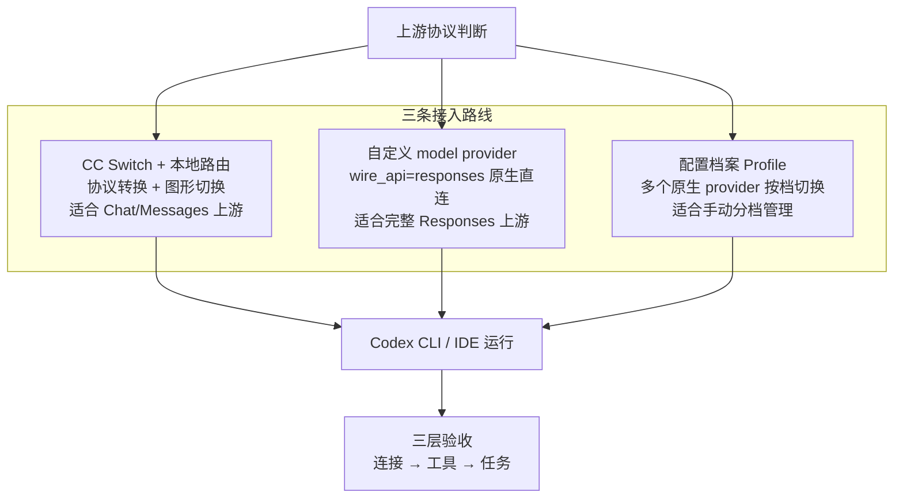

# Codex接入第三方模型总览

> 一句话总览：把 Codex 接上 DeepSeek / Kimi / Qwen / GLM 等第三方模型，核心矛盾是**协议**——Codex 只讲 Responses 协议、第三方大多只讲 Chat Completions，围绕这个分水岭再选 CC Switch / 自定义 provider / Profile 三条路线。

## 全景图

## 核心结论

- **协议分水岭**：Codex 的 `wire_api` 目前**只支持 `responses`**；第三方只有 `/v1/chat/completions` 或 Anthropic Messages 时，唯一正路是 [[CC Switch本地路由]]（协议转换网关），而不是把地址写进 config.toml。
- **三种手段各有归位**：临时切换/不会写配置/多家中转 → CC Switch；原生 Responses + 服务器 CI 无界面 → 自定义 provider；多原生 provider 按任务分档 → [[Codex配置档案Profile]]。
- **变更后必须重启 Codex**：启动时读 `config.toml`、`/model` 启动时加载模型目录；运行中切 provider 会"看起来没生效"。
- **验收不要只问"你好"**：分连接 → 工具 → 任务三层，只有文本对话成功不代表智能体工作流兼容。

## 要点拆解

### 路线选择速查

| 需求 | 推荐路线 |
|---|---|
| 第三方只提供 Chat Completions | CC Switch |
| 第三方只提供 Anthropic Messages | CC Switch |
| 经常在多个第三方间切换 | CC Switch |
| 想用图形界面管理 Key 和模型 | CC Switch |
| 第三方原生完整支持 Responses API | 自定义 provider |
| 服务器 / CI / 无图形界面 | 原生 Responses provider 或自建网关 |
| 企业统一鉴权、审计、限流 | 企业网关 + 自定义 provider |
| 只普通聊天、不支持工具调用 | 不适合当完整 Codex 智能体后端 |

### 为什么要"先手动跑通，再交给 CC Switch"

CC Switch 负责管理配置、不保证接口兼容。排障时才能分清：是服务商接口没通（Base URL / 模型名 / token 分组 / 协议），还是切换工具没同步成功（见 [[cc-switch]]）。

### 接入前置四件套

1. 已安装并运行过一次 Codex；
2. 已安装且能启动 CC Switch（若走该路线）；
3. 目标模型服务的 API Key；
4. 已确认供应商的 Base URL、模型 ID、上游协议。

### 三层验收标准

1. **连接测试**：稳定返回文本（curl 直接测 `POST <base_url>/responses`，确认不是 404、返回 Responses 风格而非只有 choices）；
2. **工具测试**：能读取文件、调用命令并正确回传结果；
3. **任务测试**：连续完成「读取 → 修改 → 运行测试 → 根据失败继续修复」的完整闭环。

### 高级能力边界

Web Search（需 `supports_standalone_web_search = true` 且上游真实兼容）、图片输入、WebSocket、响应存储在第三方场景都可能不兼容，逐个验证，不默认可用。

## 相关页面

- [[cc-switch]]：第一条路线（工具实体）
- [[CC Switch本地路由]]：协议转换机制
- [[Codex自定义模型Provider]]：第二条路线
- [[Codex配置档案Profile]]：第三条路线
- [[Codex模型映射与模型目录]]：跨两条路线的清单/菜单机制
- [[Codex官方登录保留机制]]：来回切换的退路保障
- [[Codex接第三方模型排障清单]]：常见错误速查

## 参考来源

- [[raw/articles/cc-switch-codex-第三方模型接入.md]]
- [[raw/articles/cc-switch安装与使用教程.md]]