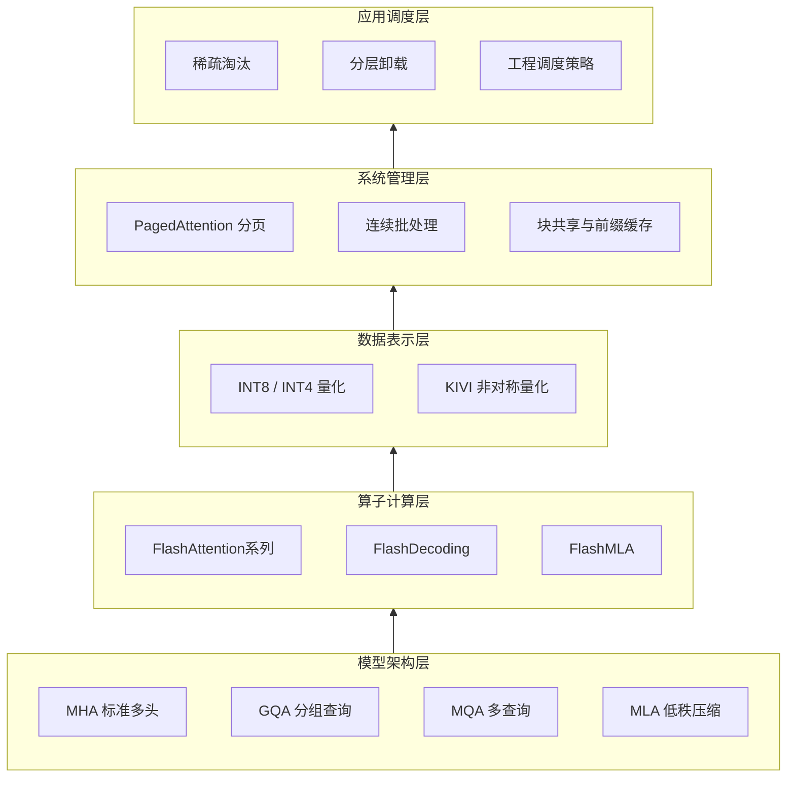

# KV Cache优化技术栈总览

## 分层架构

## 核心结论

五层各治一症、彼此**正交**：**PagedAttention 治「放得乱」，MQA/GQA 与 MLA 治「存得太多」，FlashAttention 治「算得慢、读得累」，KV Cache 量化治「存得太胖」**，应用调度层的复用、分层卸载与稀疏淘汰则负责「放不下」时的兜底。叠加后收益相乘——例如 GQA-8 配 INT4 可把 KV 压到原 MHA FP16 的 1/16。

## 各层要点与落地优先级

| 优先级 | 层 | 代表技术 | 是否需改模型 | 预期量级 |
|---|---|---|---|---|
| 1 | 系统管理层 | [[PagedAttention分页内存]] + 连续批处理 | 否，部署即开 | 显存利用率 20–40% → 96% |
| 2 | 数据表示层 | [[KVCache低比特量化]] INT8 → INT4 | 否，几乎无损 | 显存 ↓2–4× |
| 3 | 算子计算层 | [[FlashAttention算子优化]] | 否，长上下文必开 | 中间显存 $O(N^2) \to O(N)$ |
| 4 | 应用调度层 | [[前缀缓存与PagedAttention]] | 否 | 多轮/多租户收益显著 |
| 5 | 模型架构层 | [[GQA与MQA多头变体]] / [[MLA低秩潜在注意力]] | **是，需训练** | 显存 ↓4–16×，收益最大 |
| 6 | 极端场景 | 分层卸载、稀疏淘汰 | 否 | 有效容量 ↑10–50× |

落地顺序即表中序号：先零精度损失的工程项，再数据层与计算层，最后才动需要重训的架构层；分层卸载与稀疏淘汰只在超长上下文场景启用。

## 相关页面

- [[KV Cache]]：整套技术栈要解决的原始问题
- [[显存墙]]：不优化就会撞上的容量与经济性上限
- [[KV Cache分级存储]]：应用调度层中「以带宽换容量」的分层解法
- [[主流推理框架KV技术对比]]：五级栈在各家框架中的落地差异
- [[KVCache场景选型指南]]：按约束条件反查该用哪几层

## 参考来源

- [[raw/papers/KV Cache.md]]
