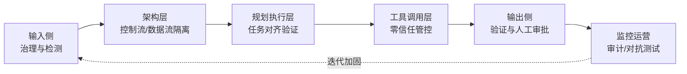
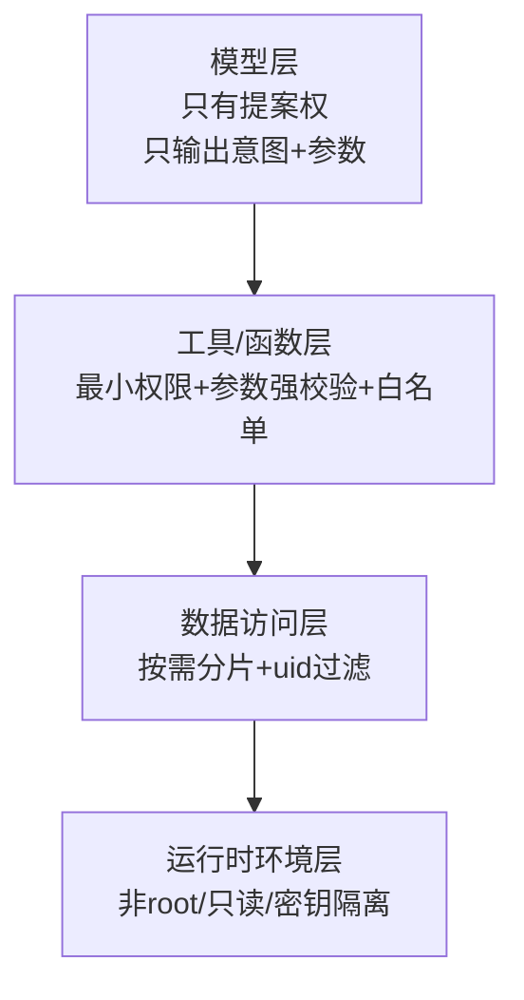

# LLM-Agent安全防护总览

## 核心结论

- **无银弹**：LLM 在架构上无法根本区分"指令"与"数据"，提示词注入无绝对解法，必须分层纵深防御[[1]](#ref-1)。
- **范式转变**：从"防止模型被说服"转向"**确保模型即使被说服也做不了坏事**"——架构隔离 + 权限最小化 + 执行管控[[1]](#ref-1)。
- **三道核心防线**：架构隔离（CaMeL/双LLM）、任务对齐验证（Task Shield/DRIFT/MELON）、工具调用策略执行（Janus/能力沙箱）[[1]](#ref-1)。

## 纵深防御六大层面

<b>图1 Agent 安全纵深防御六大层面</b>

## 权限最小化四层

<b>图2 权限最小化四层落地</b>

## 各层面速查

| 层面 | 关键手段 | 代表方案/文献 |
|---|---|---|
| ① 输入侧 | 正则清洗、字符转义、控制字符剥离、长度截断、语义分类 | ChatGLM 清洗管道、Meta Prompt-Guard-2[[2]](#ref-2) |
| ② 架构层 | 双LLM、受限Python程序+能力元数据、分层内存隔离 | CaMeL[[3]](#ref-3)、NOVA、DRIFT、AgentSys |
| ③ 规划执行层 | 任务对齐校验、计划偏差检测、掩码重执行 | Task Shield[[4]](#ref-4)、DRIFT[[5]](#ref-5)、MELON[[6]](#ref-6) |
| ④ 工具调用层 | 参数级Schema校验、工具白名单、污点跟踪、权限声明 | Janus、IPIGuard、能力沙箱 |
| ⑤ 输出侧 | JSON Schema 验证、敏感信息检测、分级人工审批 | OWASP 高风险操作人类在环[[7]](#ref-7) |
| ⑥ 监控运营 | 全链路审计、对抗性测试 CI/CD、账号风控、Fail Closed | — |

## 素材与文献

- 素材：[[raw/articles/chatglm-防提示词注入方法.md]]、[[raw/articles/deepseek-agent防提示词注入.md]]、[[raw/articles/doubao-LLM权限最小化落地.md]]
- 论文：[[raw/papers/LLM-Agent安全防护-提示词注入防御与权限最小化综合研究.md]]

## 相关页面

- [[提示词注入]]：风险分类与成因
- [[输入清洗与恶意指令向量库]]：输入侧战术层
- [[双LLM模式]]：架构隔离基础
- [[CaMeL能力沙箱]]：架构级最强防御
- [[任务对齐验证]]：规划执行层防御
- [[工具调用零信任管控]]：工具层关键防线
- [[LLM权限最小化]]：四层权限落地
- [[输出验证与人工审批]]：出口把关与审计

## 参考来源

- [[raw/papers/LLM-Agent安全防护-提示词注入防御与权限最小化综合研究.md]]

---

[1] DeepSeek/ChatGLM/豆包 Agent 安全对话素材，详见 [[raw/papers/LLM-Agent安全防护-提示词注入防御与权限最小化综合研究.md]]
[2] Meta. [Llama Prompt Guard 2](https://github.com/meta-llama/PurpleLlama/tree/main/Llama-Prompt-Guard-2)
[3] Debenedetti et al. [Defeating Prompt Injections by Design (CaMeL)](https://arxiv.org/abs/2503.18813)
[4] Jia et al. [The Task Shield](https://aclanthology.org/2025.acl-long.1435/)
[5] Li et al. [DRIFT](https://proceedings.neurips.cc/paper_files/paper/2025/file/77f3b26c7907aa27b207df9b9d43f29a-Paper-Conference.pdf)
[6] Zhu et al. [MELON](https://proceedings.mlr.press/v267/zhu25z.html)
[7] OWASP. [Substantial Abuse: High-risk actions require human approval](https://github.com/OWASP/www-project-top-10-for-large-language-model-applications/blob/main/2_0_vulns/LLM01_PromptInjection.md)