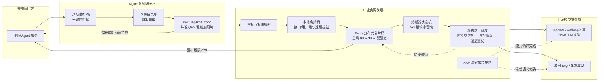

# LLM网关动态路由与流量治理总览

## 架构总览

## 核心结论
- 网关调度**双通道分离**：`5xx 熔断通道`（错误率驱动，服务端故障）与 `429 配额通道`（配额感知切换，上游配额耗尽）语义不同、计数字段互不污染，避免「429 被并入 5xx 错误率误触硬熔断」或「每次 429 都切节点导致熔断计数永不触顶」。
- **两级令牌桶**保证并发安全：`本地桶`做无网络 IO 的单实例快速预拦；`Redis 分布式桶`做多实例全局权威，解决超发。配额计费采用「预扣预估 Token + 响应后按请求 ID 退款」。
- 降级优先级固定：**同模型换 Key（故障转移）→ 异构模型降级（能力标签硬约束筛选）→ 退避重试保底（Retry-After / 指数退避+抖动）**，配全请求级重试预算防止循环放大。
- 边界场景收敛到 Marino 规则：已流式输出的 SSE 直接中断不重试、非幂等请求禁重试、长上下文请求低重试快速回 `model_busy`、月度配额用尽标记长期失效。
- 可观测分层埋点：限流/熔断与调度指标独立统计，可区分「服务端故障 vs 配额耗尽」，指导扩容或加购配额。
- AI 业务网关在 MCP（Model Context Protocol）场景下以三层落地：MCP服务端（JSON-RPC 解析）→ MCP路由模块（RAG/Tool/Memory 能力编排）→ LLM调用子模块（内置令牌桶-熔断-路由）；业务能力走 MCP 协议，仅模型推理下沉到流量调度，见 [[MCP网关]]。

## 要点拆解

### 问题根源
传统静态路由拿 429 当普通错误做简单重试，既解决不了配额耗尽，还会在多个并发请求同时重试时引发「惊群效应」→ 上游雪崩。LiteLLM / Portkey / APISIX-AI 已有 fallback，但缺 RPM/TPM 双配额精细建模、SSE 容错简陋、异构降级无能力标签校验。

### 关键设计决策
| 决策 | 方案 | 为什么 |
|------|------|--------|
| 双层架构 | Nginx 管连接/安全/并发，AI 网关管模型调度 | 职责分离，各自专注 |
| 配额建模 | 两级令牌桶 + 预扣退款 | 单机桶会超发；预估扣减避免瞬时飙过 TPM |
| 熔断统计 | 仅 5xx 驱动，SSE 以发起时刻计入 | 429 归配额通道；流式避免长耗时延迟报错 |
| 降级安全 | 能力标签硬约束 + allow_fallback 开关 | Agent 工具调用不被降级成不支持 Function Call 的模型 |
| 容错边界 | SSE 中断/非幂等禁重试/长上下文低重试 | 防止输出重复、语义错乱、重复扣费 |
| 恢复路径 | 半开探测 + 灰度回切 + Retry-After | 防止瞬间全量切回再触发限流 |

### 性能/收益口径（素材原文）
- 多为**架构方案与防御性设计**表述，素材未给出定量压测数字；与 [[MultiVis-AI]] 的「多模型路由成本↓40%」属不同层（后者是业务层静态分级路由，本文是网关层动态调度）。

## 相关页面
- [[MultiVis-AI]]：其多模型路由为业务层静态分级（短/中/长任务分段选模型），本页为网关层动态调度，互补
- [[TTFT首字延迟优化]]：SSE 流式同属链路优化，本页偏流量治理、TTFT 偏首字延迟
- [[商城AI业务矩阵]]：网关能力服务于多 Agent 调用上游的路由/限流/降级
- [[MCP网关]]：AI 业务网关的 MCP 落地形态（协议层-路由层-LLM 调用子模块三层）

## 参考来源
- [[raw/papers/面向大模型服务的动态路由与流量治理架构研究.md]]