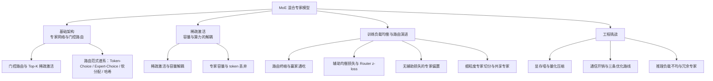
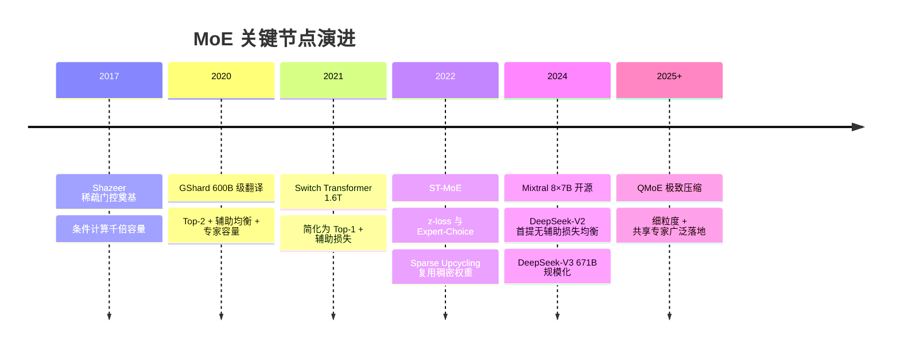

# MoE混合专家模型总览

## 全景结构

## 核心结论

MoE 的本质是把 Transformer 中的单一稠密 FFN 层换成「$N$ 个并行专家 + 可学习门控」，由路由器为每个 token 只激活其中 $K \ll N$ 个，从而**把知识容量与单次算力解耦**：模型能「记住多少」由总参数 $N \cdot |\theta_e|$ 决定，单 token 前向要「算多少」由激活参数 $K \cdot |\theta_e|$ 决定。收益因此是「容量翻倍、算力打折」。

四条主线相互咬合：**路由**决定谁被激活，**均衡**决定训练能否收敛，**架构创新**（细粒度切分 + 共享专家）决定专业化程度，**工程**（显存、通信、推理负载）决定能否落地。其代价是引入了稠密模型没有的三项挑战——[[路由坍缩与赢家通吃|路由坍缩]]、[[MoE通信开销与优化路线|跨卡通信]]、[[MoE推理部署与冗余专家|负载不均]]。

**适用边界**：数 B 以上规模 MoE 的「容量/算力比」优势显著——Mixtral 8×7B 仅激活约 28%、DeepSeek-V3 671B 仅激活约 5.5%（详见 [[MoE与稠密模型对比]]）；数 B 以内的小规模场景，稠密模型在训练稳定性与部署简易性上仍占优。

## 发展时间线

## 目录

| 章节 | 核心问题 | 落点页面 |
|---|---|---|
| 1 引言 | 为什么需要条件计算 | 本页 |
| 2 基础架构 | 谁来决定激活哪些专家 | [[门控路由与Top-K稀疏激活]]、[[路由范式谱系]] |
| 3 稀疏激活 | 容量与算力如何解耦 | [[稀疏激活与容量解耦]] |
| 4 训练均衡 | 路由坍缩怎么治 | [[路由坍缩与赢家通吃]]、[[辅助均衡损失与Router z-loss]]、[[无辅助损失的专家偏置]]、[[细粒度专家切分与共享专家]] |
| 5 工程挑战 | 显存、通信、部署三关 | [[MoE显存墙与量化压缩]]、[[MoE通信开销与优化路线]]、[[MoE推理部署与冗余专家]] |
| 6-7 对比与演进 | 何时该用 MoE | [[MoE与稠密模型对比]] |

## 关键数字速查

- **Shazeer 2017**：条件计算实现容量千倍扩展、计算量仅小幅增加。
- **DeepSeek-V3**：671B 总参 / 37B 激活，2.788M H800 GPU 小时完成训练。
- **DeepSeekMoE 16B**：约 40% 计算量达 DeepSeek 7B 稠密水平，超 2.5 倍参数的 LLaMA2 7B。
- **MegaBlocks**：取消容量约束与 token 丢弃，端到端训练加速最高 40%。
- **Megatron-Core**：未优化时仅专家并行 All-to-All 可占训练时间 30%–40%。

## 相关页面

- [[Transformer编码器结构]]：MoE 替换的是其中的 FFN 子模块，可作为阅读前置。
- [[MLA低秩潜在注意力]]：与 MoE 同为 DeepSeek 架构创新，其「瓶颈转向互连带宽与专家负载均衡」论断以 MoE 为前提。
- [[MoE与稠密模型对比]]：MoE 的能力边界与反向选型依据。
- [[MoE混合专家模型·素材摘要]]：本总览所依据的 raw 素材要点摘录。

## 参考来源

- [[raw/papers/MoE.md]]
