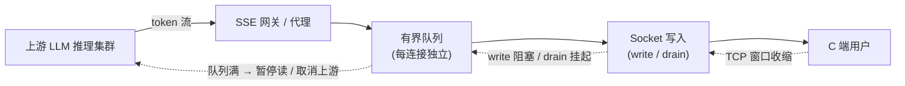

# SSE背压与内存治理总览

## 五层纵深治理框架

## 核心结论

- **背压必须透传，禁止切断**：应用层无界缓冲（把上游输出全部读进内存再转发）会绕过TCP背压，是OOM的根源；同步转发是唯一能将下游写阻塞一路反馈回上游的稳健做法。→ [[背压透传]]
- **每连接独立有界队列，满则暂停上游**：严禁全局共享队列；水位分级治理——低水位全速推、高水位通知上游降速、硬上限处对话场景暂停生成、非关键场景丢弃旧消息。→ [[SSE有界队列]]
- **慢消费者必须主动处置，配套断线续传才敢断开**：监控排空速率，超阈值主动断开；把会话增量落盘（Redis/DB），客户端带 Last-Event-ID 从断点续传，将"内存里扛住慢消费者"转化为"随时安全断开"。→ [[慢消费者处置]] [[断线续传]]
- **入口网关关闭代理层buffer + 全局水位熔断**：nginx `proxy_buffering off` + `X-Accel-Buffering: no`；进程内存70%熔断新请求、85%踢掉最慢连接；拆分为独立SSE网关与LLM推理集群，OOM不波及核心服务。→ [[入口网关水位熔断]]
- 三家方案（豆包、DeepSeek、ChatGLM）在"背压透传、禁止无界缓冲"上**结论一致**，分歧仅为落盘续传优先级与降级策略，均可调和。

## 问题根源

SSE基于`Transfer-Encoding: chunked`持续写入，协议层无应用级流控，背压只能依赖底层TCP窗口。一旦应用层"先读进内存再转发"，TCP背压即被切断。当上游生产持续大于下游消费，内存迟早耗尽。

两种典型暴涨形态：
- **框架内部缓冲区堆积**：Node response buffer、Python write queue无上限积压；
- **业务自建无界队列**：token丢进数组或`asyncio.Queue`不设上限，或一次性读全/攒满chunks整包返回。

最终只能三选一：**让上游慢下来、丢弃/合并、落盘转异步**。

## 相关页面
- [[背压透传]]：第一层——同步转发透传TCP背压
- [[SSE有界队列]]：第二层——每连接独立有界队列
- [[慢消费者处置]]：第三层——慢连接识别与主动断开
- [[断线续传]]：第三层核心配套——断线后续传机制
- [[入口网关水位熔断]]：第五层——网关buffer与全局面水位熔断
- [[Node.js stream背压]]：Node.js实现范式
- [[Python异步背压]]：Python实现范式
- [[SSE流式容错]]：SSE的差异化重试容错策略（与本页同属SSE治理，偏重试策略而非内存）
- [[TTFT首字延迟优化]]：SSE在链路中与首字延迟的关系

## 参考来源
- [[raw/papers/面向SSE流式转发的背压与内存治理研究.md]]
